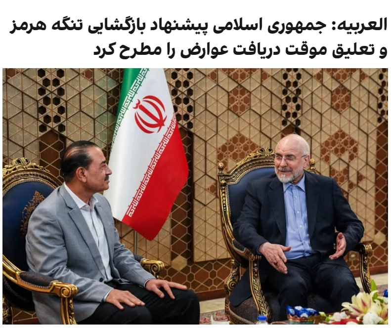
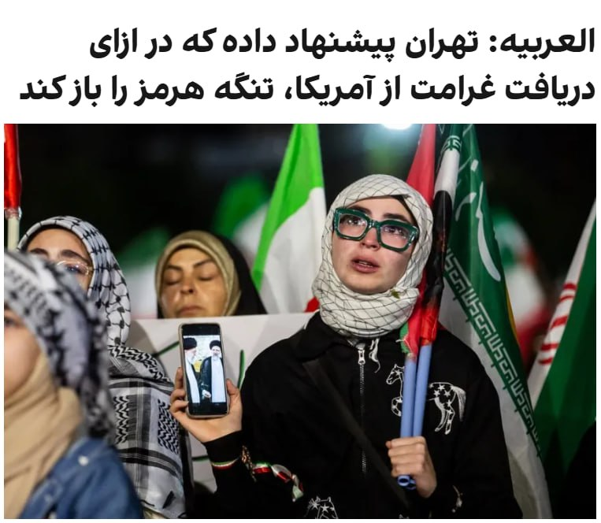
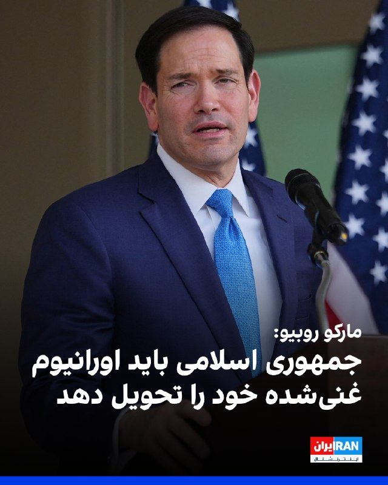
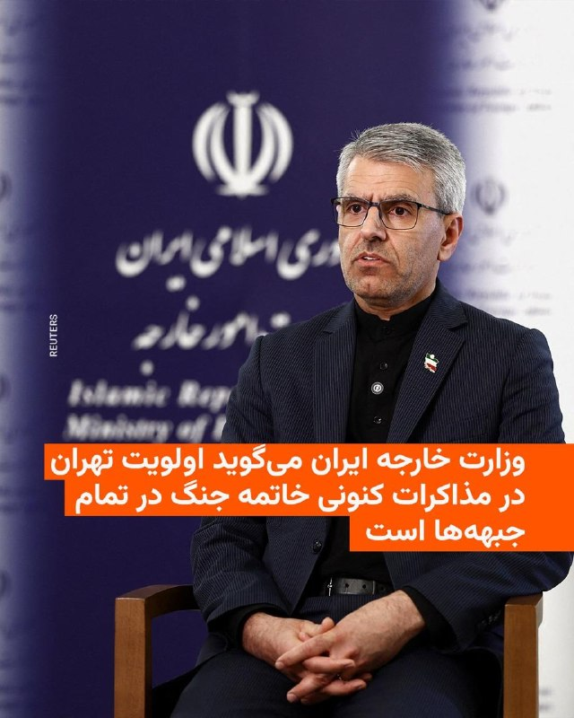
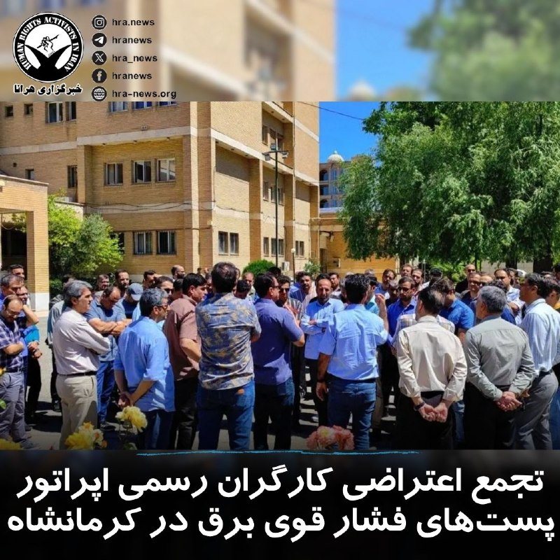

# خواننده تلگرام

<!-- TOP_NAV START -->

<a href="https://github.com/ProAlit/aio-downloader/blob/main/telegram/content/archive_1.md" style="display:inline-block; padding:6px 12px; margin:0 4px; background-color:#2ea44f; color:white; text-decoration:none; border-radius:4px; font-weight:bold;">صفحه بعد</a>

<!-- TOP_NAV END -->

<!-- MSG START -->

---
📅 بروزرسانی: 1405/03/02 19:16
---

## VahidOOnLine — post 241751

  

خبرگزاری تسنیم، وابسته به سپاه، به نقل از یک منبع مطلع نوشت که خبر العربیه درباره اینکه تهران پیشنهاد تعلیق ۱۰ ساله غنی‌سازی اورانیوم بالای ۳.۶ درصد را مطرح کرده، «از اساس کذب است».

تسنیم به نقل از این منبع با تاکید بر «ساختگی» بودن خبر العربیه، نوشت: «اساسا تمرکز پیام‌ها و گفتگوها در وضعیت فعلی صرفا بر روی مساله پایان جنگ است و هیچ جزئیاتی درباره موضوع هسته‌ای مورد بحث قرار نمی‌گیرد.»
‌🏁 🇬🇧 IranintlTV

🤖 @VahidOOnLine

## VahidOOnLine — post 241750

  <a href="telegram/content/VahidOOnLine_241750_1779551212.mp4" target="_blank">🎬 Download video</a>

فدراسیون فوتبال جمهوری اسلامی مدعی شد گزارش‌ها درباره رد ویزای شجاع خلیل‌زاده، مهدی طارمی و احسان حاج‌صفی را تکذیب کرد.

رسانه‌های ورزشی ایران در روزهای اخیر از شایعاتی درباره رد شدن ویزای این سه بازیکن تیم ملی فوتبال مردان ایران گزارش داده بودند.

فدراسیون فوتبال روز شنبه با انتشار بیانیه‌ای این گزارش‌ها را «کذب» خواند و اعلام کرد: «فرایند اداری مربوط به اخذ ویزا از سوی فدراسیون فوتبال و تیم ملی طبق روال انجام گرفته و ادعای مطرح شده کذب است.»

هم‌زمان، روزنامه خبرورزشی گزارش داد امیر قلعه‌نویی، سرمربی تیم ملی فوتبال مردان ایران، با بازیکنان جایگزین این سه عضو تیم ملی تماس گرفته تا تمرینات آمادگی برای جام جهانی را ادامه دهند.

شجاع خلیل‌زاده، مهدی طارمی و احسان حاج‌صفی از جمله ملی‌پوشان ایرانی هستند که دوران خدمت سربازی خود را در سپاه گذرانده‌اند.
‌🏁 🇬🇧 ManotoTV

🤖 @VahidOOnLine

## VahidOOnLine — post 241749

  <a href="telegram/content/VahidOOnLine_241749_1779551213.mp4" target="_blank">🎬 Download video</a>

ارتش پاکستان اعلام کرد عاصم منیر، فرمانده ارتش این کشور، سفر کوتاه اما «بسیار پرباری» به ایران داشته و در جریان آن دیدارها و گفت‌وگوهای «سطح بالا» با مقام‌های جمهوری‌اسلامی انجام داده است.
‌🏁 🇬🇧 ManotoTV

🤖 @VahidOOnLine

## VahidOOnLine — post 241748

  

خبرگزاری تسنیم، رسانه وابسته به سپاه، درباره روند مذاکرات تهران و واشینگتن، با اشاره به اینکه هنوز اختلافات جدی در بعضی از حوزه‌ها مانند تعهد واقعی آمریکا به آزادسازی اموال و موضوع تنگه هرمز وجود دارد، نوشت: «با توجه به زیاده‌خواهی‌های آمریکا، احتمال عدم حل موضوعات بالاست.»

در این گزارش آمده که در صورت حل موارد اختلاف، احتمالا در گام اول یک تفاهم اولیه اعلام شود و سپس مهلت ۳۰ یا ۶۰ روزه برای گفتگو درباره موضوع هسته‌ای (بدون تعهد اولیه جمهوری اسلامی) اعلام شود.

تسنیم نوشت که آمریکایی‌ها در متون پیشین خود تاکید داشتند که تهران در همان گام نخست باید امتیازاتی در بحث هسته‌ای بدهد و موضوع تعطیلی تاسیسات هسته‌ای و تحویل مواد غنی‌شده به آمریکایی‌ها از جمله مباحثی است که مدام در متن‌های آمریکایی‌ها مورد درخواست قرار می‌گرفت اما حکومت ایران اساسا بحث درباره جزئیات هسته‌ای را در این مرحله رد می‌کند.

بر اساس این گزارش تهران بر ضرورت پایان جنگ و تهدید در همه جبهه‌ها از جمله لبنان تاکید دارد. و این موضوع باید مورد پذیرش طرف آمریکایی قرار گیرد اما آمریکایی‌ها در برخی از متن‌های پیشین خود با این موضوعات مخالفت کرده‌اند.
‌🏁 🇬🇧 IranintlTV

🤖 @VahidOOnLine

## VahidOOnLine — post 241747

  <a href="telegram/content/VahidOOnLine_241747_1779551214.mp4" target="_blank">🎬 Download video</a>

♦️وزارت دفاع عربستان سعودی با انتشار ویدیویی در شبکه اجتماعی ایکس اعلام کرد نیروهای پدافند هوایی این کشور در قالب یک سامانه آمادگی یکپارچه، مسئول حفاظت از حریم هوایی اماکن مقدس هستند.
در این بیانیه تاکید شده این نیروها وظیفه مقابله با تمامی تهدیدات هوایی را بر عهده دارند و نقش کلیدی در تامین امنیت زائران و ایجاد آرامش برای «میهمانان» ایفا می‌کنند.
این اقدام در چارچوب تمهیدات امنیتی گسترده عربستان سعودی برای برگزاری مراسم حج و حفاظت از زائران صورت می‌گیرد.
‌🇸🇦 Indypersian

🤖 @VahidOOnLine

## VahidOOnLine — post 241746

  <a href="telegram/content/VahidOOnLine_241746_1779551215.mp4" target="_blank">🎬 Download video</a>

دونالد ترامپ، رئیس‌جمهور آمریکا، تصویری از نقشه خاورمیانه منتشر کرد که در آن ایران با طرح پرچم ایالات متحده پوشانده شده و بالای نقشه عبارت «ایالات متحده خاورمیانه؟» دیده می‌شود.

ترامپ این تصویر را در حساب خود در تروث‌سوشال منتشر کرد و توضیحی درباره منظور خود از آن ننوشت.
‌🏁 🇬🇧 ManotoTV

🤖 @VahidOOnLine

## VahidOOnLine — post 241745

  <a href="telegram/content/VahidOOnLine_241745_1779551216.mp4" target="_blank">🎬 Download video</a>

روزنامه فایننشال تایمز گزارش داده میانجی‌گران منطقه‌ای در حال نهایی کردن توافقی هستند که بر اساس آن آتش‌بس میان آمریکا و جمهوری‌اسلامی برای ۶۰ روز دیگر تمدید می‌شود و زمینه مذاکرات درباره برنامه هسته‌ای تهران را فراهم می‌کند.
بر اساس این گزارش، طرح پیشنهادی شامل بازگشایی تدریجی تنگه هرمز، گفت‌وگو درباره کاهش یا انتقال ذخایر اورانیوم غنی‌شده جمهوری‌اسلامی و همچنین کاهش محدودیت‌ها علیه بنادر ایران و آزادسازی مرحله‌ای بخشی از دارایی‌های مسدودشده تهران است.
اسماعیل بقایی، سخنگوی وزارت خارجه جمهوری‌اسلامی، گفته تهران و طرف‌های میانجی در حال تدوین «تفاهم‌نامه‌ای» برای پایان جنگ هستند و پس از آن مذاکرات درباره توافق جامع‌تر طی ۳۰ تا ۶۰ روز آینده ادامه خواهد یافت.
در همین حال، منابع دیپلماتیک گفته‌اند مذاکرات با میانجی‌گری قطر و پاکستان پیشرفت داشته، اما همچنان اختلاف‌های جدی بر سر برنامه هسته‌ای جمهوری‌اسلامی باقی مانده است؛ از جمله درخواست آمریکا برای تحویل ذخایر اورانیوم با غنای بالا و تعطیلی تاسیسات هسته‌ای نطنز، فردو و اصفهان.
این گزارش می‌افزاید کشورهای عربی منطقه نگران‌اند در صورت شکست مذاکرات و از سرگیری حملات آمریکا و اسرائیل، بحران به درگیری گسترده‌تر در خاورمیانه و اختلال شدید در بازار جهانی انرژی منجر شود.
‌🏁 🇬🇧 ManotoTV

🤖 @VahidOOnLine

## VahidOOnLine — post 241744

  <a href="telegram/content/VahidOOnLine_241744_1779551217.mp4" target="_blank">🎬 Download video</a>

مارکو روبیو، وزیر امور خارجه آمریکا، گفت در پرونده ایران «پیشرفت‌هایی» حاصل شده و ممکن است واشینگتن به‌زودی درباره این موضوع اظهارنظر تازه‌ای داشته باشد.

روبیو روز شنبه سوم خرداد در پاسخ به پرسشی درباره «موضوع ایران» گفت: «همان‌طور که گفتم، پیشرفت‌هایی حاصل شده است. حتی همین حالا که با شما صحبت می‌کنم، کارهایی در حال انجام است.»

او افزود ممکن است «امروز، فردا یا ظرف چند روز آینده» چیزی برای اعلام وجود داشته باشد، اما تاکید کرد هنوز قطعی نیست.

وزیر امور خارجه آمریکا گفت این موضوع باید «به هر شکل» حل شود و به گفته او، موضع دونالد ترامپ این است که «ایران هرگز نباید سلاح هسته‌ای داشته باشد.»

روبیو همچنین گفت تنگه‌ها باید «بدون عوارض» باز بمانند و جمهوری اسلامی باید درباره اورانیوم غنی‌شده و موضوع غنی‌سازی پاسخ‌گو باشد.
‌🏁 🇬🇧 ManotoTV

🤖 @VahidOOnLine

## VahidOOnLine — post 241743

  

♦️ بخش رسانه‌ای ارتش پاکستان (ISPR) آخرین دور گفتگوها میان میانجی‌های قطری-پاکستانی و مقامات بلندپایه جمهوری اسلامی را «کوتاه اما بسیار پربار» توصیف کرد.

بر اساس بیانیه منتشر شده، این رایزنی‌های فشرده در ۲۴ ساعت گذشته در فضایی مثبت و سازنده برگزار شده و پیشرفت‌های دلگرم‌کننده‌ای را برای دستیابی به یک تفاهم نهایی جهت پایان دادن به جنگ ایجاد کرده است. در این مذاکرات، فیلد مارشال عاصم منیر، فرمانده ارتش پاکستان، با مسعود پزشکیان، رئیس‌جمهوری، محمدباقر قالیباف، رئیس مجلس شورای اسلامی، عباس عراقچی، وزیر امور خارجه و اسکندر مومنی، وزیر کشور دیدار و گفتگو کرده است.

با این حال، به نظر می‌رسد مجتبی خامنه‌ای، رهبر جدید جمهوری اسلامی که از زمان کشته شدن پدرش در روزهای نخست حملات هوایی در انظار عمومی ظاهر نشده، در این گفتگوها مشارکتی نداشته است. ارتش پاکستان جزئیات بیشتری از مفاد دقیق این مذاکرات ارائه نکرده است.
‌🇸🇦 Indypersian

🤖 @VahidOOnLine

## VahidOOnLine — post 241742

ویدیوهای رسیده به ایران اینترنشنال نشان می‌دهد ایرانیان بریتانیا روز شنبه در لندن با حمل پرچم‌های شیروخورشید در حمایت از انقلاب ملی علیه جمهوری اسلامی تجمع کردند.
‌🏁 🇬🇧 IranintlTV

🤖 @VahidOOnLine

## VahidOOnLine — post 241741

  

فایننشال تایمز گزارش داد که میانجی‌های جنگ ایران معتقدند در حال نزدیک شدن به توافقی هستند که آتش‌بس میان واشینگتن و تهران را به مدت ۶۰ روز تمدید و چارچوبی برای مذاکرات درباره برنامه هسته‌ای جمهوری اسلامی ایجاد کند.

بنا بر این گزارش، افرادی که در جریان این مذاکرات قرار دارند به این رسانه گفتند این توافق شامل بازگشایی تدریجی تنگه هرمز و همچنین تعهد به بررسی رقیق‌سازی یا واگذاری ذخایر اورانیوم با غنای بالا خواهد بود.

فایننشال تایمز افزود که آمریکا همچنین محاصره دریایی بنادر جنوب ایران را کاهش می‌دهد و با کاهش تحریم‌ها و همچنین آزادسازی مرحله‌ای دارایی‌های مسدودشده تهران در خارج از کشور موافقت خواهد کرد.
‌🏁 🇬🇧 IranintlTV

🤖 @VahidOOnLine

## VahidOOnLine — post 241740

روایت شما از زندگی در آتش‌بس- شنبه ۲ خرداد ۱۴۰۵
🔹 ترامپ کارمند ما نیست که امر و نهی کنیم، موش علی و فرمانده‌هاش و سرکوبگرهاش رو ذلیل کرد، حالا نوبت ماست اعتصاب کنیم. نه به گوشت و مرغ رو شروع کنیم تا فراخوان بعد.
🔹 در تهران گرانی بیداد می‌کند. حقوق‌ها را دیر می‌دهند. یک کیلو توت‌فرنگی در تره‌بار ۳۰۰ هزار تومان، در مغازه معمولی ۶۰۰ هزار تومان. دارو در داروخانه کمیاب شده. یک بطری کوچک روغن زیتون یک میلیون و پانصد هزار تومان.
🔹 دم همه دانش‌آموزان غیور لر گرم که زیر بار حرف زور و ستم نمی‌روند، به‌قول شاهزاده عزیز واقعاً نسل ویکتوری هستید.
🔹 درود، من یک نوجوان ۱۶ ساله هستم که صندوق‌دار یک فروشگاه هستم. آن‌قدر همه‌چیز گران شده که حتی خودم هم خجالت می‌کشم به مشتری‌ها قیمت بدهم. واقعاً مردم ایران کوه صبر هستند. به امید روزهای خوب ایران.
‌🏁 🇬🇧 IranintlTV

🤖 @VahidOOnLine

## VahidOOnLine — post 241739

  <a href="telegram/content/VahidOOnLine_241739_1779551220.mp4" target="_blank">🎬 Download video</a>

ایرانیان سوئیس روز شنبه با تجمع مقابل سفارت جمهوری اسلامی خواستار بسته‌شدن آن شدند. آن‌ها همچنین با حمل تصاویر شاهزاده رضا پهلوی و پرچم شیروخورشید از انقلاب ملی حمایت کردند.
‌🏁 🇬🇧 IranintlTV

🤖 @VahidOOnLine

## VahidOOnLine — post 241738

  

♦️ مسعود پزشکیان، رئیس‌جمهوری اسلامی، روز شنبه دوم خرداد در دیدار با عاصم منیر، فرمانده ارتش پاکستان در تهران، با اشاره به روند مذاکرات جاری برای پایان دادن به درگیری‌های نظامی، از «بی‌اعتمادی» تهران به ایالات متحده سخن گفت.

به گزارش وب‌سایت ریاست‌جمهوری، پزشکیان با متهم کردن آمریکا به «نقض عهد مکرر و حملات در حین مذاکرات» گفت: «سابقه و تجربه مذاکره با آمریکایی‌ها به ما حکم می‌کند که نهایت دقت را به عمل آوریم.» او با ادعای اینکه تهران صرفا به دنبال احقاق حقوق قانونی خود است، تاکید کرد که واشنگتن پیروز این منازعه نخواهد بود و اسرائیل تنها طرفی است که از جنگ نفع می‌برد.

در این دیدار، عاصم منیر که کشورش نقش میانجی را میان تهران و واشنگتن ایفا می‌کند، روند گفتگوها را «رو به جلو» توصیف کرد و ابراز امیدواری کرد که این مذاکرات هرچه سریع‌تر به نتیجه مطلوب برسد. فرمانده ارتش پاکستان همچنین اسرائیل را متهم کرد که تمایلی به برقراری ثبات در منطقه ندارد.

این اظهارات در حالی مطرح می‌شود که پیشتر الجزیره از دستیابی به یک پیش‌نویس تفاهم میان دو طرف برای بازگشایی تنگه هرمز و توقف درگیری‌ها خبر داده بود.
‌🇸🇦 Indypersian

🤖 @VahidOOnLine

## VahidOOnLine — post 241737

  

الحدث گزارش داد جمهوری اسلامی در پیشنهاد جدید خود خواستار آزادسازی دارایی‌های مسدود‌شده خود قبل از مذاکرات هسته‌ای شده است.
بر اساس این گزارش، تهران خواستار ایجاد یک مکانیسم جبران خسارت جنگ از سوی ایالات متحده و لغو کامل تحریم‌ها در ازای تعهدات هسته‌ای شده است.
‌🏁 🇬🇧 IranintlTV

🤖 @VahidOOnLine

## VahidOOnLine — post 241736

  

♦️پرویز قلیچ‌خانی، از چهره‌های ماندگار فوتبال ایران، ساعاتی پیش در حومه پاریس درگذشت.
بر اساس گزارش‌ها، قلیچ‌خانی که متولد سال ۱۳۲۴ بود، در سن ۸۱ سالگی و پس از ماه‌ها تحمل بیماری چشم از جهان فروبست.
او یکی از بزرگ‌ترین بازیکنان تاریخ فوتبال ایران به‌شمار می‌رفت و سابقه کاپیتانی تیم ملی و درخشش در مسابقات آسیایی را در کارنامه خود داشت.
‌🇸🇦 Indypersian

🤖 @VahidOOnLine

## VahidOOnLine — post 241735

♦️ مارکو روبیو، وزیر امور خارجه آمریکا، روز شنبه دوم خرداد، در گفتگو با خبرنگاران از حصول پیشرفت‌هایی در خصوص مسئله ایران خبر داد و اعلام کرد که احتمال دارد طی ساعات آینده یا روزهای پیش‌رو، اخبار جدیدی در این زمینه منتشر شود.

روبیو با تاکید بر اینکه ترجیح دونالد ترامپ همواره حل بحران‌ها از طریق دیپلماسی و مذاکره است، تصریح کرد که این مشکل باید به هر طریقی حل شود و ایران هرگز نباید به سلاح هسته‌ای دست یابد. او همچنین بازگشایی بدون قید و شرط تنگه هرمز، توقف غنی‌سازی و تحویل اورانیوم با غنای بالا را از شروط اصلی و همیشگی رئیس‌جمهوری آمریکا خواند.

وزیر خارجه ایالات متحده در پایان ابراز امیدواری کرد که تلاش‌های دیپلماتیک کنونی به نتیجه برسد و به‌زودی اخبار مثبتی برای اعلام داشته باشند.
‌🇸🇦 Indypersian

🤖 @VahidOOnLine

## VahidOOnLine — post 241734

  

العربیه به نقل از منابع خود گزارش داد جمهوری اسلامی پیشنهاد بازگشایی تنگه هرمز و تعلیق موقت دریافت عوارض را مطرح کرده است.

همچنین بر اساس این گزارش، تهران پیشنهاد داده غنی‌سازی اورانیوم بالاتر از ۳.۶ درصد را به مدت ۱۰ سال به حالت تعلیق درآورد.
‌🏁 🇬🇧 IranintlTV

🤖 @VahidOOnLine

## VahidOOnLine — post 241733

♦️اسماعیل بقایی، سخنگوی وزارت امور خارجه جمهوری اسلامی، روز شنبه دوم خردادماه در گفتگو با صداوسیما تاکید کرد تنگه هرمز موضوعی مرتبط با ایران و عمان به‌عنوان کشورهای ساحلی است و آمریکا نقشی در تعیین سازوکار آن ندارد.
او با اشاره به برگزاری چندین دور مذاکره با طرف عمانی گفت ایران در حال رایزنی با کشورهای مختلف و نهادهای بین‌المللی برای ایجاد سازوکاری مؤثر جهت تضمین تردد ایمن کشتی‌ها در این آبراه است.
بقایی همچنین ناامنی‌های اخیر در تنگه هرمز ناشی از اقدامات آمریکا و اسرائیل دانست و افزود تلاش ایران و عمان در راستای حفظ امنیت کشتیرانی و تأمین منافع ملی دو کشور انجام می‌شود. او در پایان از جامعه بین‌المللی خواست با درک اهمیت این مسیر، از شکل‌گیری یک سازوکار پایدار برای آزادی دریانوردی حمایت کند.
‌🇸🇦 Indypersian

🤖 @VahidOOnLine

## VahidOOnLine — post 241732

  <a href="telegram/content/VahidOOnLine_241732_1779551226.mp4" target="_blank">🎬 Download video</a>

پرویز قلیچ‌خانی، از چهره‌های ماندگار و پرافتخار فوتبال ایران، ساعاتی پیش در حومه پاریس در ۸۱ سالگی درگذشت.

قلیچ‌خانی که متولد سال ۱۳۲۴ بود، پس از ماه‌ها تحمل بیماری جان باخت.

او یکی از برجسته‌ترین بازیکنان تاریخ فوتبال ایران به شمار می‌رفت و تنها فوتبالیست ایرانی است که سه دوره پیاپی همراه تیم ملی قهرمان جام ملت‌های آسیا شده است.
‌🏁 🇬🇧 ManotoTV

🤖 @VahidOOnLine

## WithYashar — post 12182

العربیه : ایران پیشنهاد تعلیق غنی‌سازی اورانیوم بالای 3.6% را به مدت 10 سال ارائه داد @withyashar

## WithYashar — post 12181

العربیه : ایران پیشنهاد تعلیق غنی‌سازی اورانیوم بالای 3.6% را به مدت 10 سال ارائه داد
@withyashar

## WithYashar — post 12180

🤗

## WithYashar — post 12179

## WithYashar — post 12178

مدیر شبکه افق: برای اولین بار اعلام می‌کنم که حضرت آقا تجمعات را از تلویزیون دنبال می‌کنند و از جمعیت زیاد تجمعات خوشحال هستند
@withyashar
یاشار : به عن آقا بگین پیج مارم ببینه 🤣

## WithYashar — post 12177

الحدث:ایران دو مسیر برای مذاکرات پیشنهاد کرده که با اعلام پایان جنگ و محاصره آغاز می‌شود.

ایران تأکید کرده است که در متن یادداشت تفاهم، به عدم تولید سلاح هسته‌ای متعهد خواهد بود.

ایران خواستار حفظ حق غنی‌سازی در هر توافقی شده است

ایران پیش از مذاکرات هسته‌ای خواستار آزادسازی دارایی‌های بلوکه‌شدهٔ خود شده است
@withyashar

## WithYashar — post 12176

## WithYashar — post 12175

بعد از ممنوعیت پرچم شیر و خورشید در مسابقات جام‌جهانی توسط فیفا، نشریهٔ ایندیپندنت از مجاز شدن ورود پرچم فلسطین به ورزشگاه‌های جام‌جهانی خبر داد
@withyashar 😐

## WithYashar — post 12174

## WithYashar — post 12173

  <a href="telegram/content/WithYashar_12173_1779551226.mp4" target="_blank">🎬 Download video</a>

ورود جالب وزیر دفاع آمریکا، پیت هگست به وست پوینت معروف‌ترین آکادمی نظامی ارتش آمریکا، وی متولد ۶ ژوئن ۱۹۸۰ است و الان ۴۵ سال دارد.
همسر فعلی(سوم) او جنیفر راچت نام دارد؛ تهیه‌کننده سابق فاکس‌نیوز است. حدود ۴۰ سال دارد.
پیت هگست در مجموع ۷ فرزند در خانواده ترکیبی‌اش دارد از این میان، ۴ فرزند مستقیماً فرزندان خود او هستند:
۳ پسر از همسر دومش ۱ دختر از جنیفر راچت و ۳ فرزند دیگر (۲ پسر و ۱ دختر) فرزندان جنیفر از ازدواج قبلی‌اش هستند که با هم زندگی می‌کنند.
@withyashar

## WithYashar — post 12172

ادعای العربیه: تهران در ازای پرداخت غرامت از سوی آمریکا به ایران، پیشنهاد بازگشایی تنگه هرمز را ارائه کرده است
@withyashar 🤣

## mwarmonitor — post 9547

🔴بعد تعیین درصد از سمت من ، ترامپ هم درصد احتمالی توافق یا درگیری مشخص کرد 😂

## mwarmonitor — post 9546

🔴ترامپ می‌گوید احتمالاً تا روز یکشنبه تصمیم خواهد گرفت که آیا جنگ با ایران را از سر بگیرد یا نه و به Axios گفته است که شانس رسیدن به توافق «۵۰/۵۰» است. او همچنین گفته است با مذاکره‌کنندگان آمریکایی دیدار خواهد کرد تا آخرین پیشنهاد ایران را بررسی کند، در حالی…

## mwarmonitor — post 9545

🔴ترامپ می‌گوید احتمالاً تا روز یکشنبه تصمیم خواهد گرفت که آیا جنگ با ایران را از سر بگیرد یا نه و به Axios گفته است که شانس رسیدن به توافق «۵۰/۵۰» است. او همچنین گفته است با مذاکره‌کنندگان آمریکایی دیدار خواهد کرد تا آخرین پیشنهاد ایران را بررسی کند، در حالی که میانجی‌های پاکستانی از «پیشرفت امیدوارکننده» به سمت یک تفاهم نهایی خبر داده‌اند.

@mwarmonitor

## mwarmonitor — post 9544

🔴میانجی‌ها معتقدند که به توافقی برای تمدید آتش‌بس میان آمریکا و ایران به مدت ۶۰ روز نزدیک شده‌اند — The Wall Street Journal

@mwarmonitor

## mwarmonitor — post 9543

📝از نظر من در حال حاضر سه سناریو قابل تصور است:

۱) ترامپ با یک توییت مشابه دفعات قبل، آتش‌بس را تمدید می‌کند و فرصت به دیپلماسی ؛ که می‌تواند نشانه‌ای از حرکت به سمت توافق باشد. ۱ درصد

۲) او با یک توییت نارضایتی خود را اعلام می‌کند؛ در این حالت احتمال درگیری وجود دارد، اما پایین است. ۱ درصد

۳) او هیچ واکنشی علنی نشان نمی‌دهد و در سکوت، دستور اقدام نظامی صادر می‌کند. ۹۸ درصد

@mwarmonitor

## mwarmonitor — post 9542

🔴 ارتش پاکستان: مشورت‌های فرمانده ارتش در ایران پیشرفت‌های امیدوارکننده‌ای در جهت رسیدن به یک تفاهم نهایی داشته است.

@mwarmonitor

## mwarmonitor — post 9541

🔴مذاکره‌کنندگان آمریکا و ایران طبق گزارش فایننشال تایمز به توافقی نزدیک شده‌اند که آتش‌بس را برای ۶۰ روز دیگر تمدید می‌کند. این توافق میانجی‌گری‌شده شامل بازگشایی تدریجی تنگه هرمز، آغاز مذاکرات درباره ذخایر اورانیوم غنی‌شده ایران، کاهش محدودیت‌ها بر بنادر ایران، کاهش تحریم‌ها و آزادسازی مرحله‌ای دارایی‌های بلوکه‌شده تهران در خارج از کشور خواهد بود.

@mwarmonitor

## FoxNewsTwitter — post 342161

  <a href="telegram/content/FoxNewsTwitter_342161_1779551229.mp4" target="_blank">🎬 Download video</a>

Fox News (Twitter/X)

“One way or the other, Iran can never have a nuclear weapon.”

Secretary of State Marco Rubio says negotiations with Iran are moving forward and revealed there could be developments “later today, tomorrow, in a couple of days.”

Rubio said President Trump prefers to resolve the standoff diplomatically, but stressed the administration is demanding Iran turn over its enriched uranium and address its nuclear enrichment efforts.

"Even as I speak to you now, there's some work being done," Rubio added.

## pm_afshaa — post 91292

  <a href="telegram/content/pm_afshaa_91292_1779551231.webm" target="_blank">🎬 Download video</a>

🔴دونالد ترامپ: تنها توافقی رو قبول خواهم کرد که سرنوشت اورانیوم غنی شده در ایران رو مشخص کنه.

💧 Rainbet.com the #1 Non-KYC Crypto Casino & Sportsbook @rainbetcom

😁 @Pm_Afshaa

## pm_afshaa — post 91291

🔴ترامپ به اکسیوس:
شانس توافق یا جنگ 50/50 است. بعد از دیدار با نمایندگانم تصمیم میگیرم!

امروز با نمایندگان خود دیدار خواهم کرد و تا فردا تصمیم خواهم گرفت!

💧 Rainbet.com the #1 Non-KYC Crypto Casino & Sportsbook @rainbetcom

😁 @Pm_Afshaa

## pm_afshaa — post 91290

  <a href="telegram/content/pm_afshaa_91290_1779551231.webm" target="_blank">🎬 Download video</a>

🔴تسنیم: گزارش رسانه‌های عربی در مورد غنی سازی 10 ساله 3.6 درصد دروغه و در این مرحله هیچ بحثی در مورد هسته‌ای نخواهد شد.

💧 Rainbet.com the #1 Non-KYC Crypto Casino & Sportsbook @rainbetcom

😁 @Pm_Afshaa

## pm_afshaa — post 91289

  <a href="telegram/content/pm_afshaa_91289_1779551232.webm" target="_blank">🎬 Download video</a>

🔴وال استریت ژورنال:
میانجی‌ها معتقدن به یک آتش بس 60 روزه برای توافق نهایی نزدیک شدن.

💧 Rainbet.com the #1 Non-KYC Crypto Casino & Sportsbook @rainbetcom

😁 @Pm_Afshaa

## pm_afshaa — post 91288

  <a href="telegram/content/pm_afshaa_91288_1779551233.webm" target="_blank">🎬 Download video</a>

🔴الحدث:
ایران دو مسیر برای مذاکرات پیشنهاد کرده که با اعلام پایان جنگ و محاصره آغاز میشه.

ایران تأکید کرده که در متن یادداشت تفاهم، به عدم تولید سلاح هسته‌ای متعهد خواهد بود، اما ایران خواستار حفظ حق غنی‌سازی محدود در هر توافقی شده.

ایران پیش از مذاکرات هسته‌ای خواستار آزادسازی دارایی‌های بلوکه‌شدهٔ خود شده.

💧 Rainbet.com the #1 Non-KYC Crypto Casino & Sportsbook @rainbetcom

😁 @Pm_Afshaa

## pm_afshaa — post 91287

ویدیویی از درگیری دانش آموزان با نیروهای سرکوب در خرم اباد 
💧 Rainbet.com the #1 Non-KYC Crypto Casino & Sportsbook @rainbetcom 
😁 @Pm_Afshaa

## pm_afshaa — post 91286

🔴تعداد زیادی از هواپیماهای نیروی هوایی ایالات متحده در حال حاضر از خاورمیانه به سمت اروپا در حال حرکت هستند؛این شامل 2 هواپیمای سوخت‌رسان و 6 هواپیمای ترابری می‌شود

💧 Rainbet.com the #1 Non-KYC Crypto Casino & Sportsbook @rainbetcom

😁 @Pm_Afshaa

## pm_afshaa — post 91285

این پیام ساعت ۵,۴۸ داده شده
نت خرم ابادو قطع کردن اصلا نمیشه ارتباط گرفت ولی ملت هنوز بیرونن داریم حرکت میکنیم به طرف مرکز شهر

## pm_afshaa — post 91284

  <a href="telegram/content/pm_afshaa_91284_1779551233.webm" target="_blank">🎬 Download video</a>

🔴تسنیم: با اینکه در برخی موضوعات پیشرفت‌هایی حاصل شده، اما هنوز اختلافات جدی در بعضی از حوزه‌ها مانند تعهد واقعی آمریکا به آزادسازی اموال کشور، موضوع تنگه هرمز و... وجود داره.

💧 Rainbet.com the #1 Non-KYC Crypto Casino & Sportsbook @rainbetcom

😁 @Pm_Afshaa

## pm_afshaa — post 91283

  <a href="telegram/content/pm_afshaa_91283_1779551234.mp4" target="_blank">🎬 Download video</a>

🎙️مجری: 48 ساعت اخیر پرتنش بوده و رئیس‌جمهور ترامپ تو واشنگتن مونده، اون به مراسم عروسی‌ پسرش نرفته، آیا احتمال حملات به ایران هست؟

مارکو روبیو، وزیر خارجه آمریکا:
من هیچ بازه زمانی تعیین نمیکنم اما وضعیت نمیتونه اینجور ادامه پیدا کنه و این مشکل یطوری حل میشه؛ ترجیحاً با دیپلماسی، ولی به هر حال حل میشه. فرصتی برای پذیرش توافق توسط ایران در نزدیک‌ترین زمان وجود داره.

💧 Rainbet.com the #1 Non-KYC Crypto Casino & Sportsbook @rainbetcom

😁 @Pm_Afshaa

## pm_afshaa — post 91282

  <a href="telegram/content/pm_afshaa_91282_1779551237.webm" target="_blank">🎬 Download video</a>

🔴فایننشال تایمز: میانجی‌ها معتقدن در حال نزدیک شدن به توافقی هستن که آتش‌بس میان آمریکا و ایران رو به مدت 60 روز تمدید و چارچوبی برای مذاکرات درباره برنامه هسته‌ای جمهوری اسلامی ایجاد کنه.

💧 Rainbet.com the #1 Non-KYC Crypto Casino & Sportsbook @rainbetcom

😁 @Pm_Afshaa

## pm_afshaa — post 91281

  <a href="telegram/content/pm_afshaa_91281_1779551237.webm" target="_blank">🎬 Download video</a>

🔴آسوشیتدپرس نقل از مقامات پاکستانی:
مذاکرات در مسیر درستی پیش میره.

💧 Rainbet.com the #1 Non-KYC Crypto Casino & Sportsbook @rainbetcom

😁 @Pm_Afshaa

## pm_afshaa — post 91280

  <a href="telegram/content/pm_afshaa_91280_1779551238.webm" target="_blank">🎬 Download video</a>

🔴بوسعیدی، وزیر خارجه عمان: ما واقعا پیشرفت قابل‌توجهی داشتیم، اما هنوز جزئیات مختلفی باقی مونده که باید نهایی بشه، و به همین دلیل به کمی زمان بیشتر نیاز داریم تا واقعاً به هدف نهایی، یعنی دستیابی به یک بسته جامع از توافق، برسیم. 
💧 Sponsored by @rainbetcom…

## pm_afshaa — post 91279

  <a href="telegram/content/pm_afshaa_91279_1779551239.webm" target="_blank">🎬 Download video</a>

🔴ارتش پاکستان: مذاکراتی که در 24 ساعت گذشته انجام شد، به پیشرفت امیدوارکننده‌ای به سوی تفاهم نهایی منجر شد.

💧 Rainbet.com the #1 Non-KYC Crypto Casino & Sportsbook @rainbetcom

😁 @Pm_Afshaa

## pm_afshaa — post 91278

  <a href="telegram/content/pm_afshaa_91278_1779551239.webm" target="_blank">🎬 Download video</a>

🔴العربیه: ایران پیشنهاد داده تنگه هرمز بدون عوارض باز بشه شرط اینکه دارایی‌های بلوکه شده به ایران برگرده.

همچنین ایران خواستار حق غنی سازی محدود شده!

💧 Rainbet.com the #1 Non-KYC Crypto Casino & Sportsbook @rainbetcom

😁 @Pm_Afshaa

## pm_afshaa — post 91277

  <a href="telegram/content/pm_afshaa_91277_1779551240.webm" target="_blank">🎬 Download video</a>

🔴بقائی، سخنگو وزارت خارجه:
ما هم بسیار دور و هم بسیار نزدیک به یک توافق هستیم؛ دیدگاه‌ها به هم نزدیک‌تر شدن، اما نه در حد یک توافق، بلکه در حدی که ممکنه بتونیم به راه‌حلی برسیم.

💧 Rainbet.com the #1 Non-KYC Crypto Casino & Sportsbook @rainbetcom

😁 @Pm_Afshaa

## pm_afshaa — post 91276

  <a href="telegram/content/pm_afshaa_91276_1779551241.mp4" target="_blank">🎬 Download video</a>

🔴مارکو روبیو، وزیر خارجه آمریکا:
مقداری پیشرفت در مذاکرات با ایران حاصل شده؛ احتمالا آمریکا طی روزهای آینده درباره ایران چیزی برای اعلام داشته باشه.

ایران باید اورانیوم غنی سازی شده رو به ما تحویل بده؛ ترامپ میخواد داستان ایران به صورت دیپلماتیک حل بشه. فرصتی برای پذیرش توافق توسط ایران در نزدیک‌ترین زمان وجود داره.

💧 Rainbet.com the #1 Non-KYC Crypto Casino & Sportsbook @rainbetcom

😁 @Pm_Afshaa

## DEJradio — post 4884

  <a href="telegram/content/DEJradio_4884_1779551243.webm" target="_blank">🎬 Download video</a>

🔺📢 "انقلاب و رسیدن به آزادی مثل دو استقامت است

آرش کامل، فعال رسانه

#ایرانو_پس_میگیریم #ایران
@DEJradio

## DEJradio — post 4883

⭕️فایننشال‌تایمز: تهران و واشینگتن به تمدید ۶۰ روزۀ آتش‌بس نزدیک شدند

فایننشال‌تایمز مدعی شد جمهوری اسلامی و آمریکا به توافقی برای تمدید ۶۰ روزۀ آتش‌بس نزدیک شدند.
از سویی مارکو روبیو، وزیر امور خارجۀ آمریکا، روز شنبه دوم خرداد با تکرار مواضع واشینگتن گفت مذاکرات با جمهوری اسلامی «پیشرفت‌هایی» داشته و احتمال دارد طی امروز یا دو روز آینده، خبرهایی دربارۀ نتیجۀ گفت‌وگوها و تصمیم دونالد ترامپ منتشر شود.
در سوی دیگر عباس عراقچی، وزیر امور خارجۀ جمهوری اسلامی، گفت تهران «از پشتیبانی حزب‌الله دست نمی‌کشد».
به گفتۀ منابع دیپلماتیک، جمهوری اسلامی پیوند دادن آتش‌بس لبنان با هر توافق احتمالی با آمریکا را به‌عنوان یکی از شروط خود مطرح کرده است.
از سویی ستاد فرماندهی مرکزی ایالات متحده اعلام کرد نیروهای آمریکایی در جریان اجرای محاصرۀ دریایی علیه جمهوری اسلامی، مسیر حرکت ۱۰۰ کشتی تجاری مرتبط با رژیم را تغییر داده‌اند.
سنتکام این اقدام را «نقطه عطف» عملیات دریایی آمریکا توصیف کرد.

#مذاکرات #جنگ
@DEJradio

## DEJradio — post 4882

  <a href="telegram/content/DEJradio_4882_1779551243.webm" target="_blank">🎬 Download video</a>

🔺🎤 " اول ایران را پس بگیریم؛ بعد بر سر نوع حکومت گفت‌وگو کنیم.

*مازیار نظری، هنرمند

#ایرانو_پس_میگیریم #ایران
@DEJradio

## VahidOnline — post 75654

  

خبرگزاری تسنیم، رسانه وابسته به سپاه، درباره روند مذاکرات تهران و واشینگتن، با اشاره به اینکه هنوز اختلافات جدی در بعضی از حوزه‌ها مانند تعهد واقعی آمریکا به آزادسازی اموال و موضوع تنگه هرمز وجود دارد، نوشت: «با توجه به زیاده‌خواهی‌های آمریکا، احتمال عدم حل موضوعات بالاست.»

در این گزارش آمده که در صورت حل موارد اختلاف، احتمالا در گام اول یک تفاهم اولیه اعلام شود و سپس مهلت ۳۰ یا ۶۰ روزه برای گفتگو درباره موضوع هسته‌ای (بدون تعهد اولیه جمهوری اسلامی) اعلام شود.

تسنیم نوشت که آمریکایی‌ها در متون پیشین خود تاکید داشتند که تهران در همان گام نخست باید امتیازاتی در بحث هسته‌ای بدهد و موضوع تعطیلی تاسیسات هسته‌ای و تحویل مواد غنی‌شده به آمریکایی‌ها از جمله مباحثی است که مدام در متن‌های آمریکایی‌ها مورد درخواست قرار می‌گرفت اما حکومت ایران اساسا بحث درباره جزئیات هسته‌ای را در این مرحله رد می‌کند.

بر اساس این گزارش تهران بر ضرورت پایان جنگ و تهدید در همه جبهه‌ها از جمله لبنان تاکید دارد. و این موضوع باید مورد پذیرش طرف آمریکایی قرار گیرد اما آمریکایی‌ها در برخی از متن‌های پیشین خود با این موضوعات مخالفت کرده‌اند.
@VahidOOnLine
خبرگزاری تسنیم، وابسته به سپاه، به نقل از یک منبع مطلع نوشت که خبر العربیه درباره اینکه تهران پیشنهاد تعلیق ۱۰ ساله غنی‌سازی اورانیوم بالای ۳.۶ درصد را مطرح کرده، «از اساس کذب است».
تسنیم به نقل از این منبع با تاکید بر «ساختگی» بودن خبر العربیه، نوشت: «اساسا تمرکز پیام‌ها و گفتگوها در وضعیت فعلی صرفا بر روی مساله پایان جنگ است و هیچ جزئیاتی درباره موضوع هسته‌ای مورد بحث قرار نمی‌گیرد.»
@VahidOOnLine

📡 @VahidOnline

## VahidOnline — post 75653

  

بخش رسانه‌ای ارتش پاکستان (ISPR) آخرین دور گفتگوها میان میانجی‌های قطری-پاکستانی و مقامات بلندپایه جمهوری اسلامی را «کوتاه اما بسیار پربار» توصیف کرد.

بر اساس بیانیه منتشر شده، این رایزنی‌های فشرده در ۲۴ ساعت گذشته در فضایی مثبت و سازنده برگزار شده و پیشرفت‌های دلگرم‌کننده‌ای را برای دستیابی به یک تفاهم نهایی جهت پایان دادن به جنگ ایجاد کرده است.

ارتش پاکستان جزئیات بیشتری از مفاد دقیق این مذاکرات ارائه نکرده است.
@VahidOOnLine

📡 @VahidOnline

## VahidOnline — post 75652

  

فایننشال تایمز گزارش داد که میانجی‌های جنگ ایران معتقدند در حال نزدیک شدن به توافقی هستند که آتش‌بس میان واشینگتن و تهران را به مدت ۶۰ روز تمدید و چارچوبی برای مذاکرات درباره برنامه هسته‌ای جمهوری اسلامی ایجاد کند.

بنا بر این گزارش، افرادی که در جریان این مذاکرات قرار دارند به این رسانه گفتند این توافق شامل بازگشایی تدریجی تنگه هرمز و همچنین تعهد به بررسی رقیق‌سازی یا واگذاری ذخایر اورانیوم با غنای بالا خواهد بود.

فایننشال تایمز افزود که آمریکا همچنین محاصره دریایی بنادر جنوب ایران را کاهش می‌دهد و با کاهش تحریم‌ها و همچنین آزادسازی مرحله‌ای دارایی‌های مسدودشده تهران در خارج از کشور موافقت خواهد کرد.
@VahidOOnLine

📡 @VahidOnline

## VahidOnline — post 75651

  <a href="telegram/content/VahidOnline_75651_1779551246.mp4" target="_blank">🎬 Download video</a>

🔻‌ویدیوهایی از اعتراض دانش‌آموزان در شهرهای مختلف منتشر شده است. این دانش‌آموزان به حضوری شدن امتحاناتشان اعتراض دارند.
 
دانش‌آموزان در شهرهای خرم‌آباد، یاسوج و دورود مقابل ساختمان‌های آموزش و پرورش این شهرها تجمع کردند و با شعارهای مختلف اعتراض خودشان را نشان دادند.
 
در جریان اعتراضات سراسری در دی ماه ۱۴۰۴ که به کشتار بی‌سابقه معترضان انجامید در بعضی استان‌ها مدارس غیرحضوری شد.
 
با شروع جنگ آمریکا و اسرائیل با ایران، مدارس در ایران تعطیل شد و بعد از تعطیلات نوروز کلیه کلاس‌ها غیرحضوری برگزار شد.
 
چند روز پیش عبدالرضا فولادوند، سرپرست مرکز ارزشیابی آموزش و پرورش در یک مصاحبه تلویزیونی از احتمال برگزاری امتحانات به صورت حضوری خبر داد.
@VahidHeadline

📡 @VahidOnline

## VahidOnline — post 75650

  

یک مقام جمهوری اسلامی روز شنبه دوم خرداد، در گفتگو با شبکه الجزیره اعلام کرد که تهران با میانجی‌گری پاکستان با یک تفاهم‌نامه موافقت کرده و اکنون در انتظار پاسخ ایالات متحده است.

به گفته این مقام، مفاد این تفاهم‌نامه شامل پایان دادن به جنگ، رفع کامل محاصره دریایی، بازگشایی تنگه هرمز و خروج نیروهای آمریکایی از منطقه جنگی است.
او تصریح کرد که به دلیل پیچیدگی موضوع هسته‌ای و نیاز به زمان بیشتر، این تفاهم‌نامه شامل مسائل هسته‌ای نمی‌شود؛ با این حال، پس از گذشت ۳۰ روز از اجرای این توافق، درب‌های مذاکرات هسته‌ای باز خواهد شد.

این منبع آگاه همچنین اشاره کرد که قرار بود فرمانده ارتش پاکستان این تفاهم‌نامه را در تهران اعلام کند، اما او جهت هماهنگی با واشنگتن، ایران را ترک کرده است.
او با تاکید بر نقش اساسی دولت قطر در تدوین این پیش‌نویس افزود که ایران هیچ امتیازی فراتر از آنچه در این تفاهم‌نامه قید شده، واگذار نخواهد کرد.
@VahidOOnLine
همچنین بر اساس این گزارش، تهران پیشنهاد داده غنی‌سازی اورانیوم بالاتر از ۳.۶ درصد را به مدت ۱۰ سال به حالت تعلیق درآورد.
@VahidOOnLine

🔄 آپدیت:
خبرگزاری تسنیم، وابسته به سپاه، به نقل از یک منبع مطلع نوشت که خبر العربیه درباره اینکه تهران پیشنهاد تعلیق ۱۰ ساله غنی‌سازی اورانیوم بالای ۳.۶ درصد را مطرح کرده، «از اساس کذب است».

تسنیم به نقل از این منبع با تاکید بر «ساختگی» بودن خبر العربیه، نوشت: «اساسا تمرکز پیام‌ها و گفتگوها در وضعیت فعلی صرفا بر روی مساله پایان جنگ است و هیچ جزئیاتی درباره موضوع هسته‌ای مورد بحث قرار نمی‌گیرد.»
@VahidOOnLine

📡 @VahidOnline

## VahidOnline — post 75649

  

العربیه گزارش داد جمهوری اسلامی دو پیشنهاد به میانجی پاکستانی ارائه کرده که بر اساس آن، در ازای پرداخت غرامت از سوی آمریکا، تنگه هرمز را باز کند و پیش از امضای هرگونه توافقی، پرونده تحریم‌ها و دارایی‌های مسدود شده مورد بحث قرار گیرد.

دونالد ترامپ، رییس‌جمهوری آمریکا، پیش‌تر گفته بود که حاضر به پرداخت غرامت به تهران نیست.
@VahidOOnLine

📡 @VahidOnline

## kianmeli1 — post 87582

  

🔴ترامپ
بین توافق با ایران یا بمباران آن، «قطعاً ۵۰/۵۰» است. ترامپ گفت که امروز با مشاوران ارشد خود برای بحث در مورد پیش‌نویس اخیر توافق دیدار خواهد کرد و ممکن است تا فردا تصمیمی بگیرد.
https://t.me/kianmeli1

## kianmeli1 — post 87581

‏🔴خبرگزاری تسنیم، وابسته به سپاه، به نقل از یک منبع آگاه نوشت: گزارش العربیه درباره پیشنهاد تهران برای تعلیق ۱۰ ساله غنی‌سازی بالای ۳.۶درصد «کاملا کذب» است

‏تسنیم به نقل از این منبع افزود: در شرایط فعلی تمرکز پیام‌ها و گفت‌وگوها فقط بر پایان جنگ است و درباره جزییات برنامه هسته‌ای مذاکره‌ای انجام نمی‌شود
https://t.me/kianmeli1

## IranIntlTV — post 338620

  

🔻پرویز قلیچ‌خانی، اسطوره فوتبال ایران و تنها فوتبالیست ایرانی که سه بار قهرمان جام ملت‌های آسیا شد روز شنبه دوم خرداد ۱۴۰۵ در ۸۱ سالگی در بیمارستانی در پاریس درگذشت.

🔹امروز، دوم خرداد ۱۴۰۵ هم برابر با پانزدهمین سالگرد درگذشت زنده‌یاد ناصر حجازی، دیگر اسطوره فوتبال ایران است. او روز دوم خرداد سال ۱۳۹۰ پس از یک دوره بیماری، در ۶۲ سالگی در تهران در گذشت.

🔹گزارشی درباره زندگی‌نامه زنده‌یاد پرویز قلیچ‌خانی را در وبسایت ایران اینترنشنال بخوانید.

@iranintltvsport

## IranIntlTV — post 338618

  

خبرگزاری تسنیم، وابسته به سپاه، به نقل از یک منبع مطلع نوشت که خبر العربیه درباره اینکه تهران پیشنهاد تعلیق ۱۰ ساله غنی‌سازی اورانیوم بالای ۳.۶ درصد را مطرح کرده، «از اساس کذب است».

تسنیم به نقل از این منبع با تاکید بر «ساختگی» بودن خبر العربیه، نوشت: «اساسا تمرکز پیام‌ها و گفتگوها در وضعیت فعلی صرفا بر روی مساله پایان جنگ است و هیچ جزئیاتی درباره موضوع هسته‌ای مورد بحث قرار نمی‌گیرد.»
https://iranintl.com/202605236278

## IranIntlTV — post 338617

  

خبرگزاری تسنیم، رسانه وابسته به سپاه، درباره روند مذاکرات تهران و واشینگتن، با اشاره به اینکه هنوز اختلافات جدی در بعضی از حوزه‌ها مانند تعهد واقعی آمریکا به آزادسازی اموال و موضوع تنگه هرمز وجود دارد، نوشت: «با توجه به زیاده‌خواهی‌های آمریکا، احتمال عدم حل موضوعات بالاست.»

در این گزارش آمده که در صورت حل موارد اختلاف، احتمالا در گام اول یک تفاهم اولیه اعلام شود و سپس مهلت ۳۰ یا ۶۰ روزه برای گفتگو درباره موضوع هسته‌ای (بدون تعهد اولیه جمهوری اسلامی) اعلام شود.

تسنیم نوشت که آمریکایی‌ها در متون پیشین خود تاکید داشتند که تهران در همان گام نخست باید امتیازاتی در بحث هسته‌ای بدهد و موضوع تعطیلی تاسیسات هسته‌ای و تحویل مواد غنی‌شده به آمریکایی‌ها از جمله مباحثی است که مدام در متن‌های آمریکایی‌ها مورد درخواست قرار می‌گرفت اما حکومت ایران اساسا بحث درباره جزئیات هسته‌ای را در این مرحله رد می‌کند.

بر اساس این گزارش تهران بر ضرورت پایان جنگ و تهدید در همه جبهه‌ها از جمله لبنان تاکید دارد. و این موضوع باید مورد پذیرش طرف آمریکایی قرار گیرد اما آمریکایی‌ها در برخی از متن‌های پیشین خود با این موضوعات مخالفت کرده‌اند.

## IranIntlTV — post 338616

ویدیوهای رسیده به ایران اینترنشنال نشان می‌دهد ایرانیان بریتانیا روز شنبه در لندن با حمل پرچم‌های شیروخورشید در حمایت از انقلاب ملی علیه جمهوری اسلامی تجمع کردند.

## IranIntlTV — post 338615

  <a href="telegram/content/IranIntlTV_338615_1779551251.mp4" target="_blank">🎬 Download video</a>

مارکو روبیو، وزیر خارجه آمریکا، در دیدار با نارندرا مودی، نخست‌وزیر هند، تاکید کرد ایالات متحده اجازه نخواهد داد جمهوری اسلامی بازار جهانی انرژی را گروگان بگیرد.

گفت‌وگو با تاج‌الدین سروش، عضو تحریریه ایران‌اینترنشنال
@iranintltv

## IranIntlTV — post 338614

  

فایننشال تایمز گزارش داد که میانجی‌های جنگ ایران معتقدند در حال نزدیک شدن به توافقی هستند که آتش‌بس میان واشینگتن و تهران را به مدت ۶۰ روز تمدید و چارچوبی برای مذاکرات درباره برنامه هسته‌ای جمهوری اسلامی ایجاد کند.

بنا بر این گزارش، افرادی که در جریان این مذاکرات قرار دارند به این رسانه گفتند این توافق شامل بازگشایی تدریجی تنگه هرمز و همچنین تعهد به بررسی رقیق‌سازی یا واگذاری ذخایر اورانیوم با غنای بالا خواهد بود.

فایننشال تایمز افزود که آمریکا همچنین محاصره دریایی بنادر جنوب ایران را کاهش می‌دهد و با کاهش تحریم‌ها و همچنین آزادسازی مرحله‌ای دارایی‌های مسدودشده تهران در خارج از کشور موافقت خواهد کرد.
https://iranintl.com/202605239287

## IranIntlTV — post 338613

روایت شما از زندگی در آتش‌بس- شنبه ۲ خرداد ۱۴۰۵
🔹 ترامپ کارمند ما نیست که امر و نهی کنیم، موش علی و فرمانده‌هاش و سرکوبگرهاش رو ذلیل کرد، حالا نوبت ماست اعتصاب کنیم. نه به گوشت و مرغ رو شروع کنیم تا فراخوان بعد.
🔹 در تهران گرانی بیداد می‌کند. حقوق‌ها را دیر می‌دهند. یک کیلو توت‌فرنگی در تره‌بار ۳۰۰ هزار تومان، در مغازه معمولی ۶۰۰ هزار تومان. دارو در داروخانه کمیاب شده. یک بطری کوچک روغن زیتون یک میلیون و پانصد هزار تومان.
🔹 دم همه دانش‌آموزان غیور لر گرم که زیر بار حرف زور و ستم نمی‌روند، به‌قول شاهزاده عزیز واقعاً نسل ویکتوری هستید.
🔹 درود، من یک نوجوان ۱۶ ساله هستم که صندوق‌دار یک فروشگاه هستم. آن‌قدر همه‌چیز گران شده که حتی خودم هم خجالت می‌کشم به مشتری‌ها قیمت بدهم. واقعاً مردم ایران کوه صبر هستند. به امید روزهای خوب ایران.

## IranIntlTV — post 338612

  <a href="telegram/content/IranIntlTV_338612_1779551254.mp4" target="_blank">🎬 Download video</a>

ایرانیان سوئیس روز شنبه با تجمع مقابل سفارت جمهوری اسلامی خواستار بسته‌شدن آن شدند. آن‌ها همچنین با حمل تصاویر شاهزاده رضا پهلوی و پرچم شیروخورشید از انقلاب ملی حمایت کردند.

## IranIntlTV — post 338611

  

الحدث گزارش داد جمهوری اسلامی در پیشنهاد جدید خود خواستار آزادسازی دارایی‌های مسدود‌شده خود قبل از مذاکرات هسته‌ای شده است.
بر اساس این گزارش، تهران خواستار ایجاد یک مکانیسم جبران خسارت جنگ از سوی ایالات متحده و لغو کامل تحریم‌ها در ازای تعهدات هسته‌ای شده است.
https://iranintl.com/202605238700

## IranIntlTV — post 338610

  <a href="telegram/content/IranIntlTV_338610_1779551258.mp4" target="_blank">🎬 Download video</a>

بر اساس اطلاعات رسیده به ایران‌اینترنشنال، اکبر محمدی، شهروند ۴۰ ساله اهل اصفهان، پس از بازداشت و محرومیت از رسیدگی پزشکی در زندان دستگرد اصفهان جان باخت. او که سوم اردیبهشت ماه همراه برادرش بازداشت شده بود، در تماس و در تماس با خانواده از بیماری و جلوگیری از دسترسی به بهداری و دارو خبر داده بود.

جزییات بیشتر با پویا جهاندار، عضو تحریریه ایران‌اینترنشنال
@iranintltv

## IranIntlTV — post 338609

  <a href="telegram/content/IranIntlTV_338609_1779551260.mp4" target="_blank">🎬 Download video</a>

مراسم اختتامیه جشنواره فیلم کن با اعلام برندگان جوایز اصلی، از جمله نخل طلای بهترین فیلم، به کار خود پایان داد. جایزه «چشم طلایی»، از مهم‌ترین جوایز این جشنواره، به مستند «تمرین‌هایی برای یک انقلاب» ساخته پگاه آهنگرانی اختصاص یافت.

گزارش لی‌لی نیکفر، خبرنگار ایران‌اینترنشنال
@iranintltv

## IranIntlTV — post 338608

  <a href="telegram/content/IranIntlTV_338608_1779551261.mp4" target="_blank">🎬 Download video</a>

شبکه العربیه گزارش داد عاصم منیر، فرمانده کل ارتش پاکستان، در سفر به تهران حامل پیامی از سوی آمریکا برای جمهوری اسلامی بوده است. همزمان، رسانه‌های داخلی از بررسی یک سند پیشنهادی ۱۴ بندی در این مذاکرات خبر دادند.

گفت‌وگو با حسین آقایی، عضو تحریریه ایران‌اینترنشنال
@iranintltv

## IranIntlTV — post 338607

  

العربیه به نقل از منابع خود گزارش داد جمهوری اسلامی پیشنهاد بازگشایی تنگه هرمز و تعلیق موقت دریافت عوارض را مطرح کرده است.

همچنین بر اساس این گزارش، تهران پیشنهاد داده غنی‌سازی اورانیوم بالاتر از ۳.۶ درصد را به مدت ۱۰ سال به حالت تعلیق درآورد.
https://iranintl.com/202605232120

## IranIntlTV — post 338606

  <a href="telegram/content/IranIntlTV_338606_1779551264.mp4" target="_blank">🎬 Download video</a>

سرخط خبرهای شنبه ۲ خرداد
@iranintltv

## IranIntlTV — post 338605

  <a href="telegram/content/IranIntlTV_338605_1779551266.mp4" target="_blank">🎬 Download video</a>

یکی از مجروحان انقلاب ملی ایرانیان با ارسال فایلی صوتی به ایران‌اینترنشنال، ماجرای زخمی و شکنجه شدن خود به دست نیروهای امنیتی و لباس‌شخصی در ۱۸ دی‌ماه ۱۴۰۴ را روایت کرد.

جزییات بیشتر در گفت‌وگو با محسن مهیمنی، عضو تحریریه ایران‌اینترنشنال
@iranintltv

## IranIntlTV — post 338604

  

🔻پرویز قلیچ‌خانی، اسطوره فوتبال ایران و تنها فوتبالیست ایرانی که سه بار قهرمان جام ملت‌های آسیا شد روز شنبه دوم خرداد ۱۴۰۵ در ۸۱ سالگی در بیمارستانی در پاریس درگذشت. او در پرسپولیس، تاج و پاس بازی کرد. زنده‌یاد قلیچ‌خانی، پس از انقلاب ۱۳۵۷ به دلیل گرایش‌های سیاسی از ایران خارج شد.

@iranintltvsport

## IranIntlTV — post 338603

  

مارکو روبیو، وزیر خارجه ایالات متحده آمریکا، در جریان سفر به هند، گفت: «جمهوری اسلامی باید اورانیوم غنی‌شده خود را تحویل دهد. موضوع هسته‌ای ایران، فوری است و همچنین تنگه هرمز باید باز بماند.»

روبیو افزود: «فرصتی برای پذیرش توافق از سوی حکومت ایران در نزدیک‌ترین زمان وجود دارد.»
https://iranintl.com/202605239482

## IranIntlTV — post 338602

  <a href="telegram/content/IranIntlTV_338602_1779551269.mp4" target="_blank">🎬 Download video</a>

تعدادی از شرکت‌کنندگان در تجمع برلین با نوشتن اسامی جاویدنامان بر لباس‌های خود، یاد آنها را گرامی داشتند.

یکی از شرکت‌کنندگان در این تجمع در گفت‌وگو با احمد صمدی، خبرنگار ایران‌اینترنشنال، گفت: «صدای زندانیان سیاسی، خانواده‌های جاویدنامان و مردم ایران هستیم.»
@iranintltv

## Shin_Persian — post 6164

↩️ Quoted tweet: 1776Girl ✓ @sipjack1776 Sat, 23 May 2026 15:32:00 UTC JD Vance is returning to JB Andrews from Cincinnati.🤔 C-32A #ADFEB7/98-0001/AF2 @Borrowed7Time @RealestMercury @USAF_VIP_LGX @blackswanadria @stunorth69 @ArmchairAdml ↩️ توییت نقل‌قول…

## Shin_Persian — post 6163

  

↩️ Quoted tweet:
1776Girl ✓ @sipjack1776
Sat, 23 May 2026 15:32:00 UTC

JD Vance is returning to JB Andrews from Cincinnati.🤔
C-32A
#ADFEB7/98-0001/AF2
@Borrowed7Time @RealestMercury @USAF_VIP_LGX @blackswanadria @stunorth69 @ArmchairAdml

↩️ توییت نقل‌قول شده — برای پاسخ، پست زیر را ببینید.

فارسی

جی‌دی ونس در حال بازگشت از سینسیناتی به پایگاه مشترک اندروز (JB Andrews) است.🤔
C-32A
#ADFEB7/98-0001/AF2
@Borrowed7Time @RealestMercury @USAF_VIP_LGX @blackswanadria @stunorth69 @ArmchairAdml

𝕏 · @shin_persian

## ManotoTV — post 105769

  <a href="telegram/content/ManotoTV_105769_1779551272.mp4" target="_blank">🎬 Download video</a>

فدراسیون فوتبال جمهوری اسلامی مدعی شد گزارش‌ها درباره رد ویزای شجاع خلیل‌زاده، مهدی طارمی و احسان حاج‌صفی را تکذیب کرد.

رسانه‌های ورزشی ایران در روزهای اخیر از شایعاتی درباره رد شدن ویزای این سه بازیکن تیم ملی فوتبال مردان ایران گزارش داده بودند.

فدراسیون فوتبال روز شنبه با انتشار بیانیه‌ای این گزارش‌ها را «کذب» خواند و اعلام کرد: «فرایند اداری مربوط به اخذ ویزا از سوی فدراسیون فوتبال و تیم ملی طبق روال انجام گرفته و ادعای مطرح شده کذب است.»

هم‌زمان، روزنامه خبرورزشی گزارش داد امیر قلعه‌نویی، سرمربی تیم ملی فوتبال مردان ایران، با بازیکنان جایگزین این سه عضو تیم ملی تماس گرفته تا تمرینات آمادگی برای جام جهانی را ادامه دهند.

شجاع خلیل‌زاده، مهدی طارمی و احسان حاج‌صفی از جمله ملی‌پوشان ایرانی هستند که دوران خدمت سربازی خود را در سپاه گذرانده‌اند.

## ManotoTV — post 105768

  <a href="telegram/content/ManotoTV_105768_1779551272.mp4" target="_blank">🎬 Download video</a>

ارتش پاکستان اعلام کرد عاصم منیر، فرمانده ارتش این کشور، سفر کوتاه اما «بسیار پرباری» به ایران داشته و در جریان آن دیدارها و گفت‌وگوهای «سطح بالا» با مقام‌های جمهوری‌اسلامی انجام داده است.

## ManotoTV — post 105767

  <a href="telegram/content/ManotoTV_105767_1779551273.mp4" target="_blank">🎬 Download video</a>

دونالد ترامپ، رئیس‌جمهور آمریکا، تصویری از نقشه خاورمیانه منتشر کرد که در آن ایران با طرح پرچم ایالات متحده پوشانده شده و بالای نقشه عبارت «ایالات متحده خاورمیانه؟» دیده می‌شود.

ترامپ این تصویر را در حساب خود در تروث‌سوشال منتشر کرد و توضیحی درباره منظور خود از آن ننوشت.

## ManotoTV — post 105766

  <a href="telegram/content/ManotoTV_105766_1779551274.mp4" target="_blank">🎬 Download video</a>

روزنامه فایننشال تایمز گزارش داده میانجی‌گران منطقه‌ای در حال نهایی کردن توافقی هستند که بر اساس آن آتش‌بس میان آمریکا و جمهوری‌اسلامی برای ۶۰ روز دیگر تمدید می‌شود و زمینه مذاکرات درباره برنامه هسته‌ای تهران را فراهم می‌کند.
بر اساس این گزارش، طرح پیشنهادی شامل بازگشایی تدریجی تنگه هرمز، گفت‌وگو درباره کاهش یا انتقال ذخایر اورانیوم غنی‌شده جمهوری‌اسلامی و همچنین کاهش محدودیت‌ها علیه بنادر ایران و آزادسازی مرحله‌ای بخشی از دارایی‌های مسدودشده تهران است.
اسماعیل بقایی، سخنگوی وزارت خارجه جمهوری‌اسلامی، گفته تهران و طرف‌های میانجی در حال تدوین «تفاهم‌نامه‌ای» برای پایان جنگ هستند و پس از آن مذاکرات درباره توافق جامع‌تر طی ۳۰ تا ۶۰ روز آینده ادامه خواهد یافت.
در همین حال، منابع دیپلماتیک گفته‌اند مذاکرات با میانجی‌گری قطر و پاکستان پیشرفت داشته، اما همچنان اختلاف‌های جدی بر سر برنامه هسته‌ای جمهوری‌اسلامی باقی مانده است؛ از جمله درخواست آمریکا برای تحویل ذخایر اورانیوم با غنای بالا و تعطیلی تاسیسات هسته‌ای نطنز، فردو و اصفهان.
این گزارش می‌افزاید کشورهای عربی منطقه نگران‌اند در صورت شکست مذاکرات و از سرگیری حملات آمریکا و اسرائیل، بحران به درگیری گسترده‌تر در خاورمیانه و اختلال شدید در بازار جهانی انرژی منجر شود.

## ManotoTV — post 105765

  <a href="telegram/content/ManotoTV_105765_1779551275.mp4" target="_blank">🎬 Download video</a>

مارکو روبیو، وزیر امور خارجه آمریکا، گفت در پرونده ایران «پیشرفت‌هایی» حاصل شده و ممکن است واشینگتن به‌زودی درباره این موضوع اظهارنظر تازه‌ای داشته باشد.

روبیو روز شنبه سوم خرداد در پاسخ به پرسشی درباره «موضوع ایران» گفت: «همان‌طور که گفتم، پیشرفت‌هایی حاصل شده است. حتی همین حالا که با شما صحبت می‌کنم، کارهایی در حال انجام است.»

او افزود ممکن است «امروز، فردا یا ظرف چند روز آینده» چیزی برای اعلام وجود داشته باشد، اما تاکید کرد هنوز قطعی نیست.

وزیر امور خارجه آمریکا گفت این موضوع باید «به هر شکل» حل شود و به گفته او، موضع دونالد ترامپ این است که «ایران هرگز نباید سلاح هسته‌ای داشته باشد.»

روبیو همچنین گفت تنگه‌ها باید «بدون عوارض» باز بمانند و جمهوری اسلامی باید درباره اورانیوم غنی‌شده و موضوع غنی‌سازی پاسخ‌گو باشد.

## ManotoTV — post 105764

  <a href="telegram/content/ManotoTV_105764_1779551277.mp4" target="_blank">🎬 Download video</a>

گزارشگرمنوتو: «در شرایط دشوار امروز ایران، گردهمایی پادشاهی‌خواهان شهر هامبورگ در حمایت از بانو فاطمه سپهری برگزار می‌شود؛ زنی شجاع و استوار که با وجود فشار، تهدید و زندان، از خواسته‌های مردم ایران عقب ننشسته و به نمادی از ایستادگی و آزادی‌خواهی تبدیل شده است.

ما در این گردهمایی، حمایت خود را از بانو فاطمه سپهری و همچنین از شاهزاده رضا پهلوی، به‌عنوان یکی از چهره‌های محوری همبستگی ملی و گذار به ایرانی آزاد، سکولار و دموکراتیک اعلام می‌کنیم.

این گردهمایی تأکیدی است بر ضرورت اتحاد مردم ایران برای آینده‌ای مبتنی بر آزادی، حقوق بشر و کرامت انسانی.»

## ManotoTV — post 105763

  <a href="telegram/content/ManotoTV_105763_1779551278.mp4" target="_blank">🎬 Download video</a>

پرویز قلیچ‌خانی، از چهره‌های ماندگار و پرافتخار فوتبال ایران، ساعاتی پیش در حومه پاریس در ۸۱ سالگی درگذشت.

قلیچ‌خانی که متولد سال ۱۳۲۴ بود، پس از ماه‌ها تحمل بیماری جان باخت.

او یکی از برجسته‌ترین بازیکنان تاریخ فوتبال ایران به شمار می‌رفت و تنها فوتبالیست ایرانی است که سه دوره پیاپی همراه تیم ملی قهرمان جام ملت‌های آسیا شده است.

## FarsiVOA — post 218448

مارکو روبیو، وزیر امور خارجه آمریکا، روز شنبه ۲ خرداد با انتشار تصاویری از بازدید خود از موسسه «مبلغان خیریه» در هند نوشت میراث مادر ترزا، میراثی بزرگ از خدمت و همدلی است.

آقای روبیو گفت حضور در این مرکز فرصتی برای ادای احترام به مادر ترزا و مشاهده «نمونه زنده ایمان کاتولیک در عمل» بوده است.

مادر ترزا راهبه کاتولیک و بنیانگذار موسسه «مبلغان خیریه» در هند بود. او بیشتر عمر خود را صرف کمک به فقرا و بیماران کرد. او در سال ۱۹۷۹ برنده جایزه صلح نوبل شد. کلیسای کاتولیک بعدها او را قدیس اعلام کرد.

@FarsiVOA

## FarsiVOA — post 218447

اتمام حجت روبیو و تغببر موضع و لحن ناتو پس از نشست وزیران امور خارجه ناتو؛ گفت‌وگو با امیر چاهکی، کارشناس روابط بین‌الملل

## FarsiVOA — post 218446

در گفت‌وگو با رضا غیبی، خبرنگار اقتصادی در لندن، با در نظر گرفتن انبوه بحران‌های اقتصادی، محاصره دریایی و ناتوانی جمهوری اسلامی در تأمین زنجیره کالاهای اساسی و امنیت غذایی بررسی کردیم که چگونه تشدید تنش نظامی می‌تواند به نارضایتی‌های گسترده عمومی منجر شود.

## FarsiVOA — post 218445

بابک زنجانی از «مفسد» اقتصادی تا منجی سپاه؛ گفت‌و‌گو با مهدی نخل احمدی، رونامه‌نگار

## FarsiVOA — post 218444

در گفت‌وگو با شاهین مدرس، تحلیلگر مطالعات امنیتی، به نشانه‌های آمادگی آمریکا برای دور تازه حملات پرداختیم و بررسی کردیم چگونه جمهوری اسلامی، با تکیه بر برآوردهایی مربوط به دورهای پیشین درگیری، تصویر دقیقی از توان واقعی و فرسایش‌یافته نظامی خود در شرایط کنونی و تحت محاصره دریایی آمریکا ندارد.

## FarsiVOA — post 218443

🔺تاکید مارکو روبیو بر موضع قاطع پرزیدنت ترامپ در مذاکرات: رژیم ایران هرگز سلاح هسته‌ای نخواهد داشت

▪️مارکو روبیو وزیر امور خارجه آمریکا روز شنبه ۲ خرداد برای یک سفر چهارروزه و برای شرکت در نشست وزیران امور خارجه مجمع «کوآد» وارد هند شد.

⬇️ بیشتر بخوانید:

https://ir.voanews.com/a/rubio-india-trip-modi-new-delhi-quad-marco-/8153031.html/?nocach=1

## FarsiVOA — post 218442

  

⚡️دونالد ترامپ، رئیس جمهوری آمریکا، روز شنبه ۲ خرداد در تازه‌ترین پیام خود در شبکه اجتماعی تروت سوشال عکسی از نقشه خاورمیانه را منتشر کرده که در آن نقشه ایران با پرچم ایالات متحده دیده می‌شود و در بالای آن نوشته شده است: «ایالات متحده خاورمیانه؟»
هیچ توضیح اضافه‌ای در این پست پرزیدنت ترامپ درج نشده است.

## FarsiVOA — post 218441

  <a href="telegram/content/FarsiVOA_218441_1779551279.mp4" target="_blank">🎬 Download video</a>

تصاویری دیگر از تجمع دانش‌آموزان در خرم‌آباد در اعتراض به حضوری شدن امتحانات، با شعار «مجازی، مجازی»- دوم خرداد ،۱۴۰۵؛
دانش‌آموزان در چند شهر ایران به حضوری شدن امتحانات اعتراض دارند.

## FarsiVOA — post 218440

اسپیس‌ایکس اعلام کرد فرود استارشیپ با موفقیت تایید شده و دوازدهمین آزمایش پروازی این فضاپیما با بازگشت موفق به پایان رسیده است.

اسپیس‌ایکس در پیامی از تیم این شرکت برای انجام این آزمایش تقدیر کرد.

@FarsiVOA

## DW_Farsi — post 125055

🔶 محبوبیت یک پاسپورت؛ رکورد تازه اعطای تابعیت در آلمان

به نوشته روزنامه "ولت آم زونتاگ"، در آلمان رکورد تازه‌ای در اعطای تابعیت در حال شکل‌گیری است. بر اساس تحقیقات این روزنامه که امروز شنبه ۲۳ مه (دوم خرداد) منتشر شده، در سال گذشته میلادی بیش از ۳۰۹ هزار نفر گذرنامه آلمانی دریافت کرده‌اند.

در این صورت، این رقم از رکورد پیشین، یعنی نزدیک به ۲۹۲ هزار مورد اعطای تابعیت در سال ۲۰۲۴ نیز فراتر خواهد رفت.

به نوشته این روزنامه، داده‌ها از ۱۴ ایالت آلمان گردآوری شده‌اند و فقط اطلاعات ایالت‌های مکلنبورگ-فورپومرن و زاکسن-آنهالت در دسترس نبوده است.

از ایالت‌های نیدرزاکسن، زارلند و شلسویگ-هولشتاین نیز آمار کلی وجود ندارد، اما تقریباً تمامی شهرها و مناطق این ایالت‌ها بنا به درخواست این روزنامه آلمانی، اطلاعات مربوط به تابعیت را ارائه کرده‌اند. البته بخشی از این آمار هنوز موقتی محسوب می‌شوند.
@dw_farsi

## DW_Farsi — post 125054

🎥 رقابت انسان و حیوانات اقیانوسی بر سر صید کریل‌ها

آیا مکمل‌های روزانه ما بر سلامت جانوران اقیانوسی اثر می‌گذارد؟ رشد سریع صنعت سلامت و مکمل‌ها، در کنار تغییرات اقلیمی، اکوسیستم قطب جنوب را شکننده‌تر کرده است.
@dw_farsi

## Persian_Trend_Official — post 14740

🔴دونالد ترامپ روز شنبه در گفتگو با آکسیوس مدعی شد

💢 امروز با تیم مذاکره‌کننده خود دیدار خواهد کرد تا درباره آخرین پیشنهاد ایران گفتگو کند، و احتمالاً تا یکشنبه تصمیم خواهد گرفت که جنگ را از سر بگیرد یا نه.

💢ترامپ ادعا کرد که شانس رسیدن به یک توافق «خوب» یا در غیر این صورت [حمله] را «۵۰-۵۰ محکم» ارزیابی می‌کند.

💢ترامپ گفت که روز شنبه با استیو ویتکاف و جرد کوشنر دیدار خواهد کرد تا درباره آخرین پاسخ ایران بحث کند. انتظار می‌رود معاون رئیس‌جمهور، ونس، نیز به این جلسه بپیوندد.

🫆:Tony

📌 @persian_trend_official
پرشین ترند | متفاوت‌ترین کانال نظامی

## Persian_Trend_Official — post 14739

## Persian_Trend_Official — post 14738

  <a href="telegram/content/Persian_Trend_Official_14738_1779551281.mp4" target="_blank">🎬 Download video</a>

▪️اثبات وجود تناسخ ...

خمینی ، مطهری ، بهشتی زنده شدند ...

🫆:Tony

📌 @persian_trend_official
پرشین ترند | متفاوت‌ترین کانال نظامی

## Persian_Trend_Official — post 14737

🔴 فایننشال تایمز: ایران و آمریکا به تمدید ۶۰ روزه آتش‌بس نزدیک شده‌اند

فایننشال تایمز به نقل از منابع میانجی گزارش داد تهران و واشینگتن به دستیابی به توافقی برای تمدید ۶۰ روزه آتش‌بس و فراهم‌کردن زمینه مذاکرات هسته‌ای نزدیک شده‌اند.

بر اساس این گزارش، توافق پیشنهادی شامل موارد زیر است:

▪️ بازگشایی تدریجی تنگه هرمز

▪️ گفت‌وگو درباره رقیق‌سازی یا تحویل ذخایر اورانیوم با غنای بالا

▪️ کاهش محاصره آمریکا علیه بنادر ایران

▪️ کاهش تحریم‌ها و آزادسازی مرحله‌ای دارایی‌های بلوکه‌شده ایران در خارج

♦️اما فایننشال تایمز تأکید کرده:

▪️ یکی از اصلی‌ترین موانع، درخواست ترامپ برای تحویل حدود ۴۴۰ کیلوگرم اورانیوم نزدیک به درجه تسلیحاتی ایران است

▪️ واشینگتن همچنین خواستار برچیدن سه سایت اصلی هسته‌ای ایران شامل نطنز، فردو و اصفهان شده است

🫆:Tony

📌 @persian_trend_official
پرشین ترند | متفاوت‌ترین کانال نظامی

## Persian_Trend_Official — post 14736

  <a href="telegram/content/Persian_Trend_Official_14736_1779551284.webm" target="_blank">🎬 Download video</a>

ادعای الحدث:

💢ایران دو مسیر برای مذاکرات پیشنهاد کرده که با اعلام پایان جنگ و محاصره آغاز می‌شود.

♦️ایران تأکید کرده است که در متن یادداشت تفاهم، به عدم تولید سلاح هسته‌ای متعهد خواهد بود.

♦️ایران خواستار حفظ حق غنی‌سازی در هر توافقی شده است

▪️ایران پیش از مذاکرات هسته‌ای خواستار آزسازی دارایی‌های بلوکه‌شدهٔ خود شده است./انتخاب

پ ن : زهی خیال باطل ...

🫆:Tony

📌 @persian_trend_official
پرشین ترند | متفاوت‌ترین کانال نظامی

## Persian_Trend_Official — post 14735

  

💢روبیو

♦️ تنگه هرمز باید بدون هیچ هزینه‌ای باز باشد.

🫆:Tony

📌 @persian_trend_official
پرشین ترند | متفاوت‌ترین کانال نظامی

## RadioFarda — post 157489

🔸مارکو روبیو، وزیر خارجه آمریکا، روز شنبه دوم خرداد گفت احتمال دارد ایران «به‌زودی از روز شنبه» توافقی برای پایان دادن به جنگ خاورمیانه را بپذیرد. 🔸او که در نخستین سفر خود به هند به سر می‌برد، گفت که در مذاکرات پیشرفت‌هایی حاصل شده و افزود: «ممکن است کمی…

## RadioFarda — post 157488

  

🔸مارکو روبیو، وزیر خارجه آمریکا، روز شنبه دوم خرداد گفت احتمال دارد ایران «به‌زودی از روز شنبه» توافقی برای پایان دادن به جنگ خاورمیانه را بپذیرد.

🔸او که در نخستین سفر خود به هند به سر می‌برد، گفت که در مذاکرات پیشرفت‌هایی حاصل شده و افزود: «ممکن است کمی بعدتر امروز خبرهایی داشته باشیم، و ممکن هم هست نداشته باشیم. امیدوارم خبرهایی باشد.»

🔸وزیر خارجه آمریکا همچنین گفت: «این احتمال وجود دارد که امروز، فردا یا طی چند روز آینده حرفی برای گفتن داشته باشیم.»

🔸اظهارات آقای روبیو در حالی مطرح شده که فرمانده ارتش پاکستان برای تقویت تلاش‌های میانجی‌گرانه وارد تهران شده و دونالد ترامپ، رئیس‌جمهور آمریکا، نیز به دلیل «شرایط مربوط به امور دولتی» مراسم عروسی پسرش را ترک کرده و در واشینگتن مانده است.

🔸مارکو روبیو در عین حال احتمال ازسرگیری حملات آمریکا علیه ایران را رد نکرد.

🔸او بار دیگر خواسته‌های واشینگتن را تکرار کرد و گفت ایران باید تنگه هرمز را که در واکنش به حمله آمریکا و اسرائیل کنترل آن را در دست گرفته، به‌طور کامل باز کند و همچنین اورانیوم با غنای بالا را تحویل دهد.

@RadioFarda

## RadioFarda — post 157487

🔸سخنگوی وزارت خارجه ایران می‌گوید تمرکز تهران در مذاکراتی که با میانجی‌گری پاکستان بین ایران و آمریکا جریان دارد، بر نهایی کردن یک تفاهم‌نامه با اولویت‌بخشی به پایان جنگ «در تمام جبهه‌ها به شمول لبنان» است. 🔸اسماعیل بقائی روز شنبه دوم خرداد در گفت‌وگو با…

## RadioFarda — post 157486

  

🔸سخنگوی وزارت خارجه ایران می‌گوید تمرکز تهران در مذاکراتی که با میانجی‌گری پاکستان بین ایران و آمریکا جریان دارد، بر نهایی کردن یک تفاهم‌نامه با اولویت‌بخشی به پایان جنگ «در تمام جبهه‌ها به شمول لبنان» است.

🔸اسماعیل بقائی روز شنبه دوم خرداد در گفت‌وگو با تلویزیون حکومتی ایران همچنین گفت هرگونه سازوکار مربوط به تنگه هرمز باید میان ایران و عمان مورد توافق قرار گیرد و ایالات متحده «هیچ ارتباطی» با آن ندارد.

🔸او در عین حال گفت موضوع تنگه هرمز نیز یکی از مباحث مورد بحث در یادداشت تفاهم ۱۴ بندی است و افزود موضوعات تفاهم‌نامه‌ای که تهران مشغول تدوین آن است، «به‌لحاظ کلی» بر خاتمهٔ جنگ، پایان یافتن محاصرهٔ دریایی آمریکا و آزادشدن اموال بلوکه‌شده ایران متمرکز است.

🔸سخنگوی وزارت خارجه روز شنبه با تأکید بر این‌که تهران دربارهٔ «جزئیات موضوع هسته‌ای در این مرحله» مذاکره نمی‌کند، افزود به همین دلیل «در این فرصت کوتاه دربارهٔ رفع تحریم‌ها هم صحبت نمی‌شود».

@RadioFarda

## RadioFarda — post 157484

🔸 پرویز قلیچ‌خانی، بازیکن و کاپیتان پیشین تیم ملی فوتبال ایران، بر اساس اعلام یکی از نزدیکان او روز دوم خرداد ۱۴۰۵ در بیمارستانی در حومهٔ پاریس درگذشت.

🔸 قلیچ‌خانی متولد ۸ آذر ۱۳۲۴ بود و از چهره‌های سرشناس فوتبال ایران در دهه‌های ۱۳۴۰ و ۱۳۵۰ به شمار می‌رفت. او سابقه بازی در تیم‌های تاج، پاس و پرسپولیس را داشت و سال‌ها برای تیم ملی فوتبال ایران به میدان رفت.

🔸 وی تنها بازیکن تاریخ فوتبال ایران است که سه بار همراه تیم ملی قهرمان جام ملت‌های آسیا شده و از این نظر همچنان رکورددار است. قلیچ‌خانی در مجموع ۶۶ بازی ملی انجام داد و ۱۴ گل نیز برای تیم ملی ایران به ثمر رساند.

🔸 در کنار فعالیت ورزشی، قلیچ‌خانی به دلیل مواضع و فعالیت‌های سیاسی‌اش نیز شناخته می‌شد. او در بهمن ۱۳۵۰ توسط ساواک بازداشت شد و اتهام‌هایی از جمله گرایش به گروه‌های چپ و مشارکت در ناآرامی‌های دانشسرا علیه او مطرح شد. قلیچ‌خانی پس از مدتی آزاد شد و سال‌ها بعد اعلام کرد که واقعه سیاهکل در شکل‌گیری دیدگاه‌های سیاسی او تأثیر داشته است.

🔸 او پس از خروج از ایران در فرانسه ساکن شد و نشریه «آرش» را منتشر می‌کرد.

@RadioFarda

## IranianMinds — post 20614

🔴وال‌استریت‌ژورنال:

ترامپ در جلسه تیم امنیت ملی به مشاوران خود گفت که می‌خواهد زمان بیشتری برای دیپلماسی با ایران در نظر بگیرد.

@IranianMinds

## IranianMinds — post 20613

🔴مارکو روبیو درباره ایران:

ممکن است امروز خبرهایی بیاید، ممکن هست خبرهایی نیاید، شاید هم بیاید، مطمئن نیستم.

روبیو هم رد داده دیگه.

@IranianMinds

## BBCPersian — post 281886

  <a href="telegram/content/BBCPersian_281886_1779551287.mp4" target="_blank">🎬 Download video</a>

🔻‌ویدیوهایی از اعتراض دانش‌آموزان در شهرهای مختلف منتشر شده است. این دانش‌آموزان به حضوری شدن امتحاناتشان اعتراض دارند.
 
دانش‌آموزان در شهرهای خرم‌آباد، یاسوج و دورود مقابل ساختمان‌های آموزش و پرورش این شهرها تجمع کردند و با شعارهای مختلف اعتراض خودشان را نشان دادند.
 
در جریان اعتراضات سراسری در دی ماه ۱۴۰۴ که به کشتار بی‌سابقه معترضان انجامید در بعضی استان‌ها مدارس غیرحضوری شد.
 
با شروع جنگ آمریکا و اسرائیل با ایران، مدارس در ایران تعطیل شد و بعد از تعطیلات نوروز کلیه کلاس‌ها غیرحضوری برگزار شد.
 
چند روز پیش عبدالرضا فولادوند، سرپرست مرکز ارزشیابی آموزش و پرورش در یک مصاحبه تلویزیونی از احتمال برگزاری امتحانات به صورت حضوری خبر داد.
 
https://bbc.in/4a7X523
@BBCPersian

## BBCPersian — post 281884

🔻رئیس دانشگاه علوم پزشکی ایران: امکان انتقال جنین‌های فریز‌شده به محل‌های امن وجود دارد

رئیس دانشگاه علوم پزشکی ایران با اشاره به وضعیت جنین‌های نگهداری‌شده در مراکز درمان ناباروری در دوران جنگ گفت که این نمونه‌ها تحت شرایط «ایمن و قابل انتقال نگهداری می‌شوند و در صورت بروز خطر یا آسیب دیدن مراکز درمانی مانند بیمارستان گاندی، امکان انتقال آن‌ها به محل‌های امن وجود دارد.»

نادر توکلی گفت که در مراکز ناباروری معمولاً چند جنین به صورت استاندارد فریز می‌شوند و قابلیت جابجایی را دارند بنابراین اگر در جریان جنگ نیاز بوده، این انتقال انجام شده است.

او درباره تعداد مصدومان جنگ که هنوز در مراکز درمانی تهران بستری هستند گفت که حدودا «کمتر از ۱۰ مصدوم جنگی» با عوارض شدید هنوز تحت درمان هستند.

https://bbc.in/4utVGeA
@BBCPersian

## BBCPersian — post 281883

🔻عضو کمیسیون امنیت مجلس ایران درباره جلسه قالیباف و منیر: برخی از موضع‌گیری‌های اخیر آمریکا نگران کننده است

فداحسین مالکی، نماینده مجلس ایران و عضو کمیسیون امنیت ملی، که در مذاکرات محمدباقر قالیباف با فیلد مارشال عاصم منیر، فرمانده کل ارتش و نیروهای مسلح پاکستان، حضور داشت گفته است که «برخی از موضع‌گیری‌های اخیر آمریکایی‌ها به‌خصوص ترامپ و وزیر خارجه تندروی آمریکا، قدری نگران‌کننده است که باید طرف پاکستانی این مسائل را بیشتر لحاظ کند.»

آقای مالکی به خبرگزاری ایسنا گفت: «هر دو طرف ایرانی و پاکستانی پذیرفتند که این چالش‌ها و ندانم‌کاری‌ها از ناحیه آمریکاست که به توافق نهایی ضربه می‌زند و حتی ممکن است میز مذاکره را کم‌رنگ کند به خصوص از ناحیه افرادی مانند [استیو] ویتکاف [فرستاده ویژه رئیس جمهور آمریکا] که گزارش‌های غیرواقع به ترامپ می‌دهند و ترامپ هم براساس آن، توییت می‌زند و موجب ایجاد حساسیت در ایران و حتی کدورت در دوستان پاکستانی ما می‌شود.»

به گفته آقای مالکی «آنچه در این دیدار مسلم بود،‌ خیلی از موضوعات را آمریکایی‌ها پذیرفته‌اند، اما ما هنوز مراحلی داریم که در جلسات بعد مشخص می‌شود و امشب نیز مذاکرات عمیق‌تری میان دو طرف وجود دارد.»

عاصم منیر که دیروز وارد تهران شده بود پس از دیدار با رئیس جمهور، رئیس مجلس و وزیر خارجه ایران، امروز تهران را ترک کرد.

https://bbc.in/4fDudlT
@BBCPersian

## BBCPersian — post 281882

🔻ادامه حملات اسرائیل به لبنان

حملات اسرائیل به اهدافی در خاک لبنان با وجود آتش‌بس امروز هم ادامه داشت.

خبرگزاری رسمی لبنان گزارش داد که اسرائیل حدود ۱۲ نقطه در جنوب لبنان را هدف حمله هوایی قرار داد از جمله یک منطقه کشاورزی که «چند کارگر سوری زخمی شدند.»

علاوه بر این، ارتش لبنان در بیانیه‌ای گفت که در حمله اسرائیل به یک پادگان در جنوب، یک سرباز زخمی شده است: «در نتیجه هدف قرار گرفتن خصمانه یک پادگان ارتش در شهر نبطیه از سوی اسرائیل، یک نظامی دچار جراحت شد.»

این خبرگزاری همچنین اعلام کرد در حمله شب گذشته به شهر صور در جنوب لبنان، مکانی در نزدیکی بیمارستان را هدف قرار گرفت که «خسارات شدیدی» به این مرکز درمانی وارد کرد.

خبرنگار خبرگزاری فرانسه از محل گزارش داده است که که شیشه‌ها شکسته، سقف‌ها فرو ریخته و تجهیزات پزشکی در بیمارستان آسیب دیده‌ است.

ارتش اسرائیل شامگاه جمعه پیش از حمله به دو نقطه در شهر صور، هشدار ترک صادر و اعلام کرده بود که «تأسیسات حزب‌الله» را هدف قرار خواهد داد.

https://bbc.in/3PBSRJa
@BBCPersian

## BBCPersian — post 281881

🔻رسانه‌های ایران می‌گویند شاخص بازار سهام رشد داشته است

رسانه‌های ایران می‌گویند بازار سهام در پایان معاملات اولین روز هفته رشد داشته است.

خبرگزاری رسمی ایرنا می‌گوید بازار سهام امروز با رشد ۷۰ هزار واحدی به ارتفاع سه میلیون و ۸۳۱ هزار واحد رسید.

رشد شاخص بورس به معنای افزایش میانگین قیمت سهام و سودآوری شرکت‌های فعال در بازار است.

بازار بورس ایران که با جنگ اخیر تعطیل شد، پس از هشتاد روز توقف دوباره بازگشایی شده است.

https://bbc.in/42Nfbm6
@BBCPersian

## Dirty_Kids — post 390019

  <a href="telegram/content/Dirty_Kids_390019_1779551289.mp4" target="_blank">🎬 Download video</a>

والا😂😂 جون بکن بگو تمومش کن

@Dirty_Kids 👻

## Dirty_Kids — post 390018

اگر ایران تا ۷۲ ساعت دیگر اینترنت را وصل نکند، بنده هر جا که زمین خالی ببینم خشخاش میکارم، خودم به تنهایی یک تمدن بزرگ رو نابود خواهم کرد.
از توجه شما به این موضوع سپاسگزارم.

@Dirty_Kids 👻

## Dirty_Kids — post 390017

  

تیشرت موردعلاقم بعد از ۴۰-۵۰ :)))

@Dirty_Kids 👻

## Dirty_Kids — post 390016

  <a href="telegram/content/Dirty_Kids_390016_1779551291.mp4" target="_blank">🎬 Download video</a>

۲ خرداد سالگرد درگذشت اسطوره فوتبال ایران ناصر خان حجازی گرامی باد 💙🦅

خاطره جالب از همسر ناصرخان :)))

@Dirty_Kids 👻

## Dirty_Kids — post 390015

  <a href="telegram/content/Dirty_Kids_390015_1779551292.mp4" target="_blank">🎬 Download video</a>

شروع اعتراضات و پرتاب گاز اشک آور توسط سرکوبگران!

دانش آموزا بخاطر اینکه امتحاناتشون مجازی بشه دارن اعتراض میکنن تا الانم یه سری شهر‌ها مجازی شدن

+ بیشتر شبیهه تقلیل دادن مطالبات مردم هست ولی خب...

@Dirty_Kids 👻

## Hranews — post 113117

  

امروز شنبه ۲ خردادماه، شماری از رانندگان استیجاری در مقابل ساختمان نهاد ریاست جمهوری در تهران تجمع اعتراضی برگزار کردند. این #رانندگان شاغل در دستگاه‌های اجرایی سراسر کشور، خواستار رسیدگی به موضوع تبدیل وضعیت اشتغال خود هستند.

↘️
@hranews_bot تماس ✉️ - @Hranews کانال هرانا 🆑

## Hranews — post 113116

یک شکارچی متخلف در کامیاران به مجازات جایگزین حبس محکوم شد

❗️
❗️
❗️
❗️
❗️– رئیس حفاظت محیط زیست کامیاران از صدور حکم سبز برای یک شکارچی متخلف خبر داد و اعلام کرد که این متهم ملزم به تامین ۱۰ آبشخور برای حیات‌وحش، بدل از مجازات حبس، محکوم شده است.

ادامه مطلب

#حکم_سبز

↘️
@hranews_bot تماس ✉️ - @Hranews کانال هرانا 🆑

## Hranews — post 113115

  

جمعی از کارگران رسمی اپراتور پست‌های فشار قوی برق، امروز شنبه با برگزاری تجمع اعتراضی مقابل ساختمان برق منطقه‌ای غرب در کرمانشاه، خواستار بازنگری در مصوبه رفاهیات #کارگران و اجرای طرح «فوق‌العاده خاص» شدند.

↘️
@hranews_bot تماس ✉️ - @Hranews کانال هرانا 🆑

## manototv — post 105769

  <a href="telegram/content/manototv_105769_1779551295.mp4" target="_blank">🎬 Download video</a>

فدراسیون فوتبال جمهوری اسلامی مدعی شد گزارش‌ها درباره رد ویزای شجاع خلیل‌زاده، مهدی طارمی و احسان حاج‌صفی را تکذیب کرد.

رسانه‌های ورزشی ایران در روزهای اخیر از شایعاتی درباره رد شدن ویزای این سه بازیکن تیم ملی فوتبال مردان ایران گزارش داده بودند.

فدراسیون فوتبال روز شنبه با انتشار بیانیه‌ای این گزارش‌ها را «کذب» خواند و اعلام کرد: «فرایند اداری مربوط به اخذ ویزا از سوی فدراسیون فوتبال و تیم ملی طبق روال انجام گرفته و ادعای مطرح شده کذب است.»

هم‌زمان، روزنامه خبرورزشی گزارش داد امیر قلعه‌نویی، سرمربی تیم ملی فوتبال مردان ایران، با بازیکنان جایگزین این سه عضو تیم ملی تماس گرفته تا تمرینات آمادگی برای جام جهانی را ادامه دهند.

شجاع خلیل‌زاده، مهدی طارمی و احسان حاج‌صفی از جمله ملی‌پوشان ایرانی هستند که دوران خدمت سربازی خود را در سپاه گذرانده‌اند.

## manototv — post 105768

  <a href="telegram/content/manototv_105768_1779551295.mp4" target="_blank">🎬 Download video</a>

ارتش پاکستان اعلام کرد عاصم منیر، فرمانده ارتش این کشور، سفر کوتاه اما «بسیار پرباری» به ایران داشته و در جریان آن دیدارها و گفت‌وگوهای «سطح بالا» با مقام‌های جمهوری‌اسلامی انجام داده است.

## manototv — post 105767

  <a href="telegram/content/manototv_105767_1779551296.mp4" target="_blank">🎬 Download video</a>

دونالد ترامپ، رئیس‌جمهور آمریکا، تصویری از نقشه خاورمیانه منتشر کرد که در آن ایران با طرح پرچم ایالات متحده پوشانده شده و بالای نقشه عبارت «ایالات متحده خاورمیانه؟» دیده می‌شود.

ترامپ این تصویر را در حساب خود در تروث‌سوشال منتشر کرد و توضیحی درباره منظور خود از آن ننوشت.

## manototv — post 105766

  <a href="telegram/content/manototv_105766_1779551297.mp4" target="_blank">🎬 Download video</a>

روزنامه فایننشال تایمز گزارش داده میانجی‌گران منطقه‌ای در حال نهایی کردن توافقی هستند که بر اساس آن آتش‌بس میان آمریکا و جمهوری‌اسلامی برای ۶۰ روز دیگر تمدید می‌شود و زمینه مذاکرات درباره برنامه هسته‌ای تهران را فراهم می‌کند.
بر اساس این گزارش، طرح پیشنهادی شامل بازگشایی تدریجی تنگه هرمز، گفت‌وگو درباره کاهش یا انتقال ذخایر اورانیوم غنی‌شده جمهوری‌اسلامی و همچنین کاهش محدودیت‌ها علیه بنادر ایران و آزادسازی مرحله‌ای بخشی از دارایی‌های مسدودشده تهران است.
اسماعیل بقایی، سخنگوی وزارت خارجه جمهوری‌اسلامی، گفته تهران و طرف‌های میانجی در حال تدوین «تفاهم‌نامه‌ای» برای پایان جنگ هستند و پس از آن مذاکرات درباره توافق جامع‌تر طی ۳۰ تا ۶۰ روز آینده ادامه خواهد یافت.
در همین حال، منابع دیپلماتیک گفته‌اند مذاکرات با میانجی‌گری قطر و پاکستان پیشرفت داشته، اما همچنان اختلاف‌های جدی بر سر برنامه هسته‌ای جمهوری‌اسلامی باقی مانده است؛ از جمله درخواست آمریکا برای تحویل ذخایر اورانیوم با غنای بالا و تعطیلی تاسیسات هسته‌ای نطنز، فردو و اصفهان.
این گزارش می‌افزاید کشورهای عربی منطقه نگران‌اند در صورت شکست مذاکرات و از سرگیری حملات آمریکا و اسرائیل، بحران به درگیری گسترده‌تر در خاورمیانه و اختلال شدید در بازار جهانی انرژی منجر شود.

## manototv — post 105765

  <a href="telegram/content/manototv_105765_1779551298.mp4" target="_blank">🎬 Download video</a>

مارکو روبیو، وزیر امور خارجه آمریکا، گفت در پرونده ایران «پیشرفت‌هایی» حاصل شده و ممکن است واشینگتن به‌زودی درباره این موضوع اظهارنظر تازه‌ای داشته باشد.

روبیو روز شنبه سوم خرداد در پاسخ به پرسشی درباره «موضوع ایران» گفت: «همان‌طور که گفتم، پیشرفت‌هایی حاصل شده است. حتی همین حالا که با شما صحبت می‌کنم، کارهایی در حال انجام است.»

او افزود ممکن است «امروز، فردا یا ظرف چند روز آینده» چیزی برای اعلام وجود داشته باشد، اما تاکید کرد هنوز قطعی نیست.

وزیر امور خارجه آمریکا گفت این موضوع باید «به هر شکل» حل شود و به گفته او، موضع دونالد ترامپ این است که «ایران هرگز نباید سلاح هسته‌ای داشته باشد.»

روبیو همچنین گفت تنگه‌ها باید «بدون عوارض» باز بمانند و جمهوری اسلامی باید درباره اورانیوم غنی‌شده و موضوع غنی‌سازی پاسخ‌گو باشد.

## manototv — post 105764

  <a href="telegram/content/manototv_105764_1779551300.mp4" target="_blank">🎬 Download video</a>

گزارشگرمنوتو: «در شرایط دشوار امروز ایران، گردهمایی پادشاهی‌خواهان شهر هامبورگ در حمایت از بانو فاطمه سپهری برگزار می‌شود؛ زنی شجاع و استوار که با وجود فشار، تهدید و زندان، از خواسته‌های مردم ایران عقب ننشسته و به نمادی از ایستادگی و آزادی‌خواهی تبدیل شده است.

ما در این گردهمایی، حمایت خود را از بانو فاطمه سپهری و همچنین از شاهزاده رضا پهلوی، به‌عنوان یکی از چهره‌های محوری همبستگی ملی و گذار به ایرانی آزاد، سکولار و دموکراتیک اعلام می‌کنیم.

این گردهمایی تأکیدی است بر ضرورت اتحاد مردم ایران برای آینده‌ای مبتنی بر آزادی، حقوق بشر و کرامت انسانی.»

## manototv — post 105763

  <a href="telegram/content/manototv_105763_1779551301.mp4" target="_blank">🎬 Download video</a>

پرویز قلیچ‌خانی، از چهره‌های ماندگار و پرافتخار فوتبال ایران، ساعاتی پیش در حومه پاریس در ۸۱ سالگی درگذشت.

قلیچ‌خانی که متولد سال ۱۳۲۴ بود، پس از ماه‌ها تحمل بیماری جان باخت.

او یکی از برجسته‌ترین بازیکنان تاریخ فوتبال ایران به شمار می‌رفت و تنها فوتبالیست ایرانی است که سه دوره پیاپی همراه تیم ملی قهرمان جام ملت‌های آسیا شده است.

## alonews — post 122073

  <a href="telegram/content/alonews_122073_1779551302.webm" target="_blank">🎬 Download video</a>

🔴فوری/آکسیوس : ترامپ گفت احتمال اینکه به ایران حمله کنه و یا توافق بشه 50/50 هست همچنین ترامپ شنبه با استیو ویتکوف و جرد کوشنر دیدار میکند تا آخرین پیشنهاد ایران را بررسی کند و انتظار میرود تا یکشنبه تصمیم‌ گیری شود 
✅ @AloNews خبر جنگ

## alonews — post 122072

  <a href="telegram/content/alonews_122072_1779551302.webm" target="_blank">🎬 Download video</a>

🔴فوری/آکسیوس :
ترامپ گفت احتمال اینکه به ایران حمله کنه و یا توافق بشه 50/50 هست
همچنین ترامپ شنبه با استیو ویتکوف و جرد کوشنر دیدار میکند تا آخرین پیشنهاد ایران را بررسی کند و انتظار میرود تا یکشنبه تصمیم‌ گیری شود

✅ @AloNews خبر جنگ

## alonews — post 122071

  <a href="telegram/content/alonews_122071_1779551302.webm" target="_blank">🎬 Download video</a>

👈العربیه: ایران پیشنهاد تعلیق غنی‌سازی اورانیوم بالای ۳.۶ درصد را به مدت ۱۰ سال ارائه داد 
✅ @AloNews خبر جنگ

## alonews — post 122070

  <a href="telegram/content/alonews_122070_1779551303.webm" target="_blank">🎬 Download video</a>

👈العربیه: ایران پیشنهاد تعلیق غنی‌سازی اورانیوم بالای ۳.۶ درصد را به مدت ۱۰ سال ارائه داد

✅ @AloNews خبر جنگ

## alonews — post 122069

  <a href="telegram/content/alonews_122069_1779551303.webm" target="_blank">🎬 Download video</a>

👈فایننشال تایمز به نقل از یک دیپلمات مطلع از مذاکرات: به نظر می‌رسد توافق در مسیر درستی پیش می‌رود. اکنون توافق برای بررسی دست آمریکایی‌هاست.

✅ @AloNews خبر جنگ

## alonews — post 122068

  <a href="telegram/content/alonews_122068_1779551303.mp4" target="_blank">🎬 Download video</a>

👈هگست : میدونم ارتش عاشق غرق کردن نیروی دریاییه
- و فعلا تنها نیروی دریایی که اجازه دارید غرقش کنید نیروی دریایی "ایرانه"

✅ @AloNews خبر جنگ

## alonews — post 122067

  

مجری صدا و سیما آرپی‌جی آورده تو برنامه، انگار قسمت سربازی برره‌اس :)))

[@AloTweet]

## alonews — post 122066

  <a href="telegram/content/alonews_122066_1779551306.webm" target="_blank">🎬 Download video</a>

👈خبرگزاری آسوشیتدپرس به نقل از مقامات پاکستانی گزارش داد:

🔴اسلام آباد به تلاش‌های خود برای ترتیب دادن دور دوم مذاکرات مستقیم بین تهران و واشنگتن ادامه می‌دهد.

✅ @AloNews خبر جنگ

## alonews — post 122065

  <a href="telegram/content/alonews_122065_1779551306.webm" target="_blank">🎬 Download video</a>

👈طی ۲۴ساعت گذشته بولشویک‌ها حملات شدیدی علیه پزشکیان انجام دادن و طبق شنیده‌ها دنبال استعفای رئیس جمهور هستن تا گزینه مد نظر خودشون(زنبیل به دست) رو بیارن بالا

✅ @AloNews خبر جنگ

## alonews — post 122064

  <a href="telegram/content/alonews_122064_1779551306.webm" target="_blank">🎬 Download video</a>

👈ارتش پاکستان: مذاکراتی که در ۲۴ ساعت گذشته انجام شد، به پیشرفت امیدوارکننده‌ای به سوی تفاهم نهایی منجر شد.

✅ @AloNews خبر جنگ

## alonews — post 122063

  <a href="telegram/content/alonews_122063_1779551307.webm" target="_blank">🎬 Download video</a>

👈الحدث:ایران دو مسیر برای مذاکرات پیشنهاد کرده که با اعلام پایان جنگ و محاصره آغاز می‌شود.

🔴ایران تأکید کرده است که در متن یادداشت تفاهم، به عدم تولید سلاح هسته‌ای متعهد خواهد بود.

🔴ایران خواستار حفظ حق غنی‌سازی در هر توافقی شده است

🔴ایران پیش از مذاکرات هسته‌ای خواستار آزادسازی دارایی‌های بلوکه‌شدهٔ خود شده است

✅ @AloNews خبر جنگ

## alonews — post 122062

  <a href="telegram/content/alonews_122062_1779551307.mp4" target="_blank">🎬 Download video</a>

👈ارسالی شما/سلام ادمین ماهم تجمع کردیم جلوی اداره آموزش پرورش لرستان و اینجا هم امتحانا مجازی شد

✅ @AloNews خبر جنگ

## alonews — post 122059

  <a href="telegram/content/alonews_122059_1779551309.mp4" target="_blank">🎬 Download video</a>

👈جدیدا دانش آموزان استان‌هایی که امتحانات‌شون حضوریه، می‌ریزن جلو آموزش و پرورش منطقه و میگن ما فقط مجازی امتحان میدیم؛

🔴اتفاقا جواب هم داده و تا الان این استان‌ها مجازی شده :

- یزد
- مرکزی
- گیلان
- کهگیلویه و بویراحمد
- کرمان

✅ @AloNews خبر جنگ

<!-- MSG END -->

<!-- NAV START -->

<a href="https://github.com/ProAlit/aio-downloader/blob/main/telegram/content/archive_1.md" style="display:inline-block; padding:6px 12px; margin:0 4px; background-color:#2ea44f; color:white; text-decoration:none; border-radius:4px; font-weight:bold;">صفحه بعد</a>

<!-- NAV END -->
